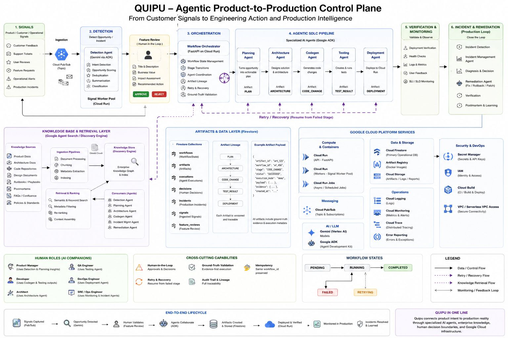
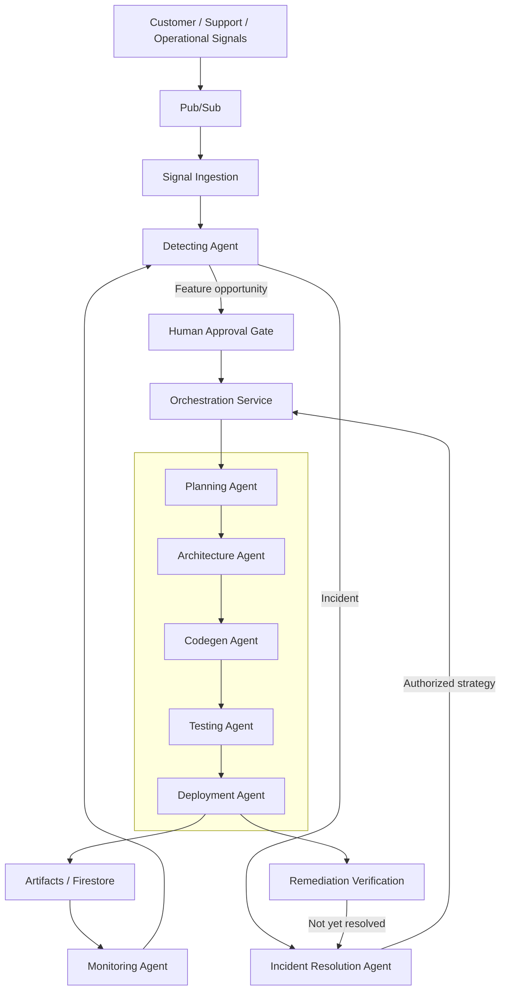
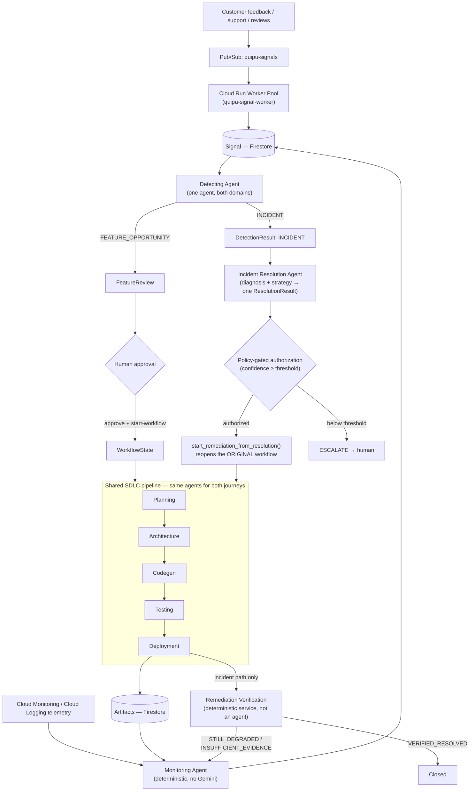
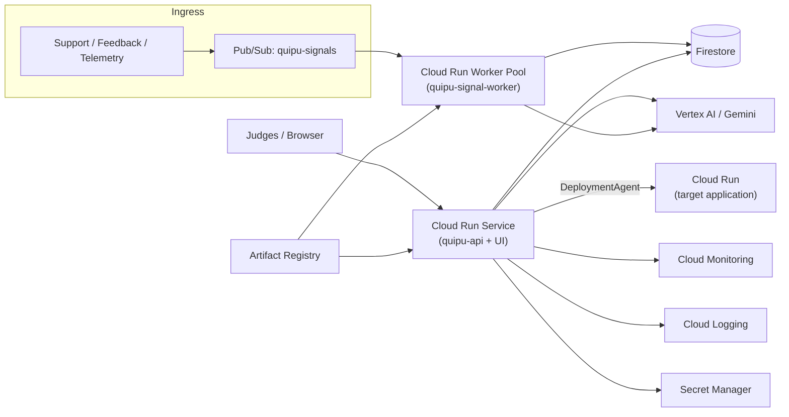

# Quipu

An agentic control plane that turns customer/operational signals into validated, tested, deployed engineering work — and closes the loop back from production incidents into remediation.

**Repository**: https://github.com/RaHuL-SrIrAM-E/Quipu.ai



*A simplified view for readability — "Remediation Agent" and "Incident Mgmt Agent" above represent a flow, not separate agent classes: in the actual implementation this is `IncidentResolutionAgent` (diagnosis only) plus `OrchestrationService.start_remediation_from_resolution()` reopening the same Planning/Architecture/Codegen/Testing/Deployment agents used for feature work. See [Agent architecture](#agent-architecture) for the precise mapping.*

---

## Table of contents

1. [Overview](#overview)
2. [The problem](#the-problem)
3. [The solution](#the-solution)
4. [Agent architecture](#agent-architecture)
5. [Human-in-the-loop](#human-in-the-loop)
6. [Workflow / orchestration](#workflow--orchestration)
7. [Retry / recovery](#retry--recovery)
8. [Production incident / remediation story](#production-incident--remediation-story)
9. [Google Cloud architecture](#google-cloud-architecture)
10. [Google ADK / agent implementation](#google-adk--agent-implementation)
11. [Repository structure](#repository-structure)
12. [Local development / spin-up](#local-development--spin-up)
13. [Google Cloud deployment](#google-cloud-deployment)
14. [Environment variables](#environment-variables)
15. [End-to-end demo](#end-to-end-demo)
16. [API endpoints](#api-endpoints)
17. [Safety / security](#safety--security)
18. [Testing / validation](#testing--validation)
19. [What is real vs. demo](#what-is-real-vs-demo)
20. [Limitations / roadmap](#limitations--roadmap)
21. [Why Quipu](#why-quipu)
22. [Hackathon reproducibility checklist](#hackathon-reproducibility-checklist)

---

## Overview

Quipu is an **agentic product-to-production control plane**. It turns signals from customers, support tickets, and production telemetry into validated engineering workflows, and coordinates a set of specialized AI agents — each backed by Gemini via Google ADK — through the full lifecycle those workflows require:

```
Business signal → Detection → Human approval → Planning → Architecture
    → Code generation → Testing → Deployment → Verification / monitoring
    → Incident response → Remediation
```

Quipu is **not a coding agent**. A coding agent starts at "here is a ticket, write the code." Quipu starts earlier — at the raw signal that a ticket should exist at all — and stays engaged after code ships, watching production for evidence that the change actually worked. The differentiator is the **complete lifecycle** and the **coordination contract between specialized agents**, enforced by a deterministic orchestration layer that never lets any single agent's self-report be the final word on whether something actually happened.

## The problem

- Product, customer, and support signals are fragmented across tools — nothing correlates a support ticket, a feedback form entry, and a telemetry anomaly into one picture.
- Real feature opportunities and operational issues stay buried in that fragmented feedback instead of becoming engineering work.
- Turning a validated opportunity into shipped code requires many manual handoffs: PM → architect → developer → QA → DevOps/SRE, each in a different tool.
- Production incidents create a second, disconnected loop: someone has to notice, investigate, decide, and only then trigger the same engineering machinery again.
- The result is a persistent gap between **"a customer told us something"** and **"engineering safely acted on it"** — bridged today almost entirely by manual triage and handoffs.

## The solution

Quipu is an event-driven control plane spanning that entire gap, with a single orchestration layer coordinating every stage and an explicit human approval gate before anything customer-facing turns into a workflow.



The **event-driven ingestion** side (Pub/Sub → `SignalConsumerWorker` → `SignalIngestionService`) is fully decoupled from the **orchestration** side (`OrchestrationService` driving `WorkflowState` through its stages) — a Signal existing never implies a workflow will be created; that only happens after Detection classifies it and, for product opportunities, a human approves it.

## Agent architecture

Every agent below is a `QuipuAgent` (`app/agent_runtime/base.py`) with its own declared identity and capability set, backed by a real Google ADK `LlmAgent` (Gemini) unless noted otherwise. Agents never call each other directly — they communicate only through persisted `Artifact`s and the deterministic `OrchestrationService`, and every agent's factual claims about the outside world are independently re-verified by application code rather than trusted from the model's own narration ("evidence-first").

| Agent | File | Input | Output | Lifecycle stage | Human-role companion |
|---|---|---|---|---|---|
| **Detecting Agent** | `app/agents/detecting.py` | A bounded, already-persisted set of `Signal`s | `DetectionResult` (FEATURE_OPPORTUNITY or INCIDENT) | Signal → Detection | Product Manager / Product Operations |
| **Planning Agent** | `app/agents/planning.py` | An approved `Ticket` | `PLAN` artifact + a real Jira ticket | Planning | Product Manager / Engineering Manager |
| **Architecture Agent** | `app/agents/architecture.py` | `PLAN` artifact | `ARCHITECTURE` artifact (files/modules to touch) | Architecture | Software Architect / Senior Developer |
| **Codegen Agent** | `app/agents/codegen.py` | `ARCHITECTURE` artifact | `CODE_CHANGE` artifact, real file writes in a cloned workspace | Codegen | Developer |
| **Testing Agent** | `app/agents/testing.py` | `CODE_CHANGE` artifact | `TEST_RESULT` artifact, from an actual `pytest` run | Testing | QA / Developer |
| **Deployment Agent** | `app/agents/deployment.py` | `CODE_CHANGE` artifact (tested) | `DEPLOYMENT` artifact, from a real Cloud Run Admin API call | Deployment | DevOps / Platform Engineering |
| **Monitoring Agent** | `app/agents/monitoring.py` | Cloud Monitoring/Logging queries (no Gemini — deterministic by design) | `Signal`s derived from real production telemetry | Continuous / Monitoring | SRE / Operations |
| **Incident Resolution Agent** | `app/agents/incident_resolution.py` | `DetectionResult` (INCIDENT) + evidence Signals | `ResolutionResult` — diagnosis + a recommended, policy-gated remediation strategy | Incident diagnosis | SRE / Incident Commander |

None of these agents autonomously replace the human role listed — each is framed as a **companion operating inside a controlled workflow**, with explicit approval/authorization boundaries (below) before anything it proposes takes real effect.

**On "Incident Management"**: Quipu does not ship a single monolithic "incident management agent." Incident handling is a *flow* across three of the agents above — Monitoring observes, Detecting classifies an anomaly as an incident, and Incident Resolution diagnoses it and proposes (never executes) a remediation strategy. `OrchestrationService.start_remediation_from_resolution()` is the deterministic application code that turns an authorized `ResolutionResult` into re-executed Architecture/Codegen/Testing/Deployment stages — the same agents used for feature work, reused for remediation rather than duplicated.

There is also a legacy, unused stub package at `app/orchestrator/` (singular — note the different module name from the real `app/orchestration/`) containing placeholder classes (`app/agents/coding.py`, `devops.py`, `incident_management.py`, `feature_detection.py`, each ~13–78 lines, `TODO`-only bodies). It is not imported by `app/main.py` or any API route and is not part of the live system — mentioned here only for completeness when reading the repository tree.

## Human-in-the-loop

For product opportunities, Quipu never turns arbitrary feedback directly into a running workflow:

```
Signal(s) → Detecting Agent → FeatureReview (PENDING) → Human approval → start-workflow → WorkflowState
```

`POST /feature-reviews/{id}/approve` requires a real reviewer identity (`app/api/auth.py:require_reviewer_identity` — never an agent-supplied value), and even after approval, `POST /feature-reviews/{id}/start-workflow` is a **separate, explicit** call — approving an opportunity and starting engineering work are deliberately two different actions, not one.

For incidents, the equivalent boundary is authorization of a `ResolutionResult`: `IncidentResolutionAgent` never executes anything itself, and `OrchestrationService.start_remediation_from_resolution()` re-derives authorization deterministically from the persisted strategy/risk (never trusting `resolution.target_agent` blindly) before reopening the original workflow. A resolution whose confidence falls below `incident_resolution_min_confidence_for_auto_remediation` (default `0.7`) is downgraded to `ESCALATE` regardless of what the model proposed.

## Workflow / orchestration

`WorkflowState` (`app/domain/workflow.py`) is the single source of truth for one engineering run:

```python
workflow_id: str
ticket: Ticket
status: WorkflowStatus        # pending | running | waiting | completed | failed | blocked | cancelled | escalated
current_stage: WorkflowStage  # planning | architecture | codegen | testing | deployment | monitoring | detection | incident_resolution | completed
artifact_ids: list[str]
active_decision_id: str | None
execution_ids: list[str]
active_incident_ids: list[str]
metadata: dict[str, Any]
version: int                  # optimistic concurrency
```

`OrchestrationService.execute_next_step()` advances exactly one stage at a time, fetching each stage's required upstream artifact, invoking the corresponding agent, and persisting the resulting `Artifact` — `PLAN → ARCHITECTURE → CODE_CHANGE → TEST_RESULT → DEPLOYMENT` — before moving `current_stage` forward. `run_to_completion()` (used by `POST /workflows/{id}/run`) is the same loop, bounded by `workflow_run_max_iterations` (default 20) so one HTTP request can never become an unbounded loop. A failure at any stage sets `status=FAILED` and leaves `current_stage` exactly where it failed, ready for retry.

## Retry / recovery

A failed workflow is **reopened**, not duplicated:

```
Workflow FAILED
      ↓
POST /workflows/{workflow_id}/retry
      ↓
Workflow PENDING  (same workflow_id, same current_stage, same artifact_ids/execution_ids)
      ↓
POST /workflows/{workflow_id}/run  (or /step)
      ↓
resume at the failed stage → continue the pipeline
```

`retry_failed_workflow()` (`app/orchestration/service.py`) only flips `status` back to `PENDING` and increments a `retry_count` in metadata — `current_stage`, `artifact_ids`, and `execution_ids` are untouched, so already-successful upstream artifacts (Plan, Architecture, …) are never regenerated. `FeatureReview.workflow_id` is never modified, so the review-to-workflow pointer stays stable across any number of retries. The write is concurrency-safe via `WorkflowRepository.update_if_version` — of two simultaneous retries, exactly one wins.

**Honest limitation**: `retry_count` is tracked but **not currently capped** — there is no maximum-retry ceiling enforced by `retry_failed_workflow()` itself (unlike the per-agent `max_codegen_retries`/`max_test_retries`/`max_deployment_retries` the orchestrator's own automatic decision loop already enforces). This is a documented gap, not a hidden one.

## Production incident / remediation story

Quipu's architecture extends past feature delivery into a closed production loop:

```
Production monitoring → Incident detection → Diagnosis / decision
    → (authorized) Remediation → Verification
```

`MonitoringAgent` converts real Cloud Monitoring/Cloud Logging queries into `Signal`s; `DetectingAgent` can classify a cluster of those signals as an `INCIDENT`; `IncidentResolutionAgent` diagnoses it and proposes a remediation strategy without executing anything; an authorized `ResolutionResult` reopens the *original* workflow that shipped the offending change, running it back through Architecture/Codegen/Testing/Deployment; and `RemediationVerification` (`app/verification/`) checks fresh post-deployment telemetry before ever concluding `VERIFIED_RESOLVED` — a successful deployment alone is never reported as "resolved."

The two journeys — a feature opportunity and a production incident — share the same `DetectingAgent` and the same five-stage SDLC pipeline; Quipu does not run a separate, duplicated agent stack for each:



Deliberately absent from this diagram (because they don't exist in the codebase, despite appearing in some earlier draft diagrams for this submission): a separate "Incident Detection Agent" (it's the same `DetectingAgent` for both domains), separate "Diagnosis"/"Decision"/"Remediation"/"Verification"/"Postmortem" agents (diagnosis+decision are one `IncidentResolutionAgent` output; remediation reuses the existing Architecture/Codegen/Testing/Deployment agents; verification is a plain service, not an ADK agent; there is no postmortem stage), a separate "Incident Orchestrator" (one `OrchestrationService` drives both journeys), and dedicated `DIAGNOSIS`/`DECISION`/`REMEDIATION`/`VERIFICATION`/`POSTMORTEM` artifact types (the real `ArtifactType` enum has none of these — see [Workflow / orchestration](#workflow--orchestration)).

**Be precise about what this claim rests on**: this full incident→remediation→verification chain is implemented and covered by `tests/test_incident_remediation.py` and the deterministic `DemoHarness.run_incident_flow()` (`app/demo/harness.py`, exercised by `tests/test_demo_incident_flow.py`), which proves the chain including a *second* remediation cycle whose evidence stays `STILL_DEGRADED`. **It has not been demonstrated as one continuous run against the live, deployed GCP project** in this hackathon submission — the live E2E run actually performed and verified against `quipu-507109` (see [End-to-end demo](#end-to-end-demo)) exercises the **feature-opportunity** path, not the incident-remediation path. The incident/remediation capability is real, tested application code; its live-GCP execution is an architectural capability that was not part of the demonstrated run.

## Google Cloud architecture

Every service below was verified directly against the live project `quipu-507109` (`us-central1`) via `gcloud`, not assumed from documentation.

| Service | Role | Where used |
|---|---|---|
| **Cloud Run (Service)** | Hosts Quipu's own Control Plane API + built UI (`quipu-api`) | `Dockerfile`, `app/main.py` |
| **Cloud Run (Worker Pool)** | Runs the long-lived Pub/Sub signal consumer (`quipu-signal-worker`) | `Dockerfile.worker`, `app/eventing/worker_main.py` |
| **Cloud Run (Admin API, target apps)** | What `DeploymentAgent` calls to deploy the *target* application it's building for — a distinct usage from Quipu's own hosting above | `app/core/cloud_run_client.py` |
| **Pub/Sub** | Transport for inbound customer/support/operational signals (`quipu-signals` topic, `quipu-signals-sub` subscription, `quipu-signals-dlq` dead-letter topic) | `app/eventing/google_pubsub_client.py` |
| **Artifact Registry** | Docker image storage (`quipu` repo, `us-central1`) for both the API and worker images | `docs/deployment/gcp.md` §9–10 |
| **Cloud Build / local Docker** | Image build — this project currently builds/pushes images with local `docker build`/`docker push` rather than `gcloud builds submit`, due to a Cloud Build service-account IAM gap identified during deployment (not fixed in this submission) | see [Google Cloud deployment](#google-cloud-deployment) |
| **Firestore (Native mode)** | Durable state for every domain entity — `workflows/{id}/{artifacts,executions,decisions}`, `signals/`, `detections/`, `resolutions/`, `remediation_verifications/`, `feature_reviews/` | `app/persistence/firestore/*.py` |
| **Cloud Monitoring** | Real-time metrics read by `MonitoringAgent` | `app/core/cloud_monitoring_client.py` |
| **Cloud Logging** | Log-entry queries read by `MonitoringAgent` | `app/core/cloud_logging_client.py` |
| **Vertex AI (Gemini, via Google ADK)** | Reasoning for every LLM-backed agent | `app/agents/*.py`, `google-adk`/`google-genai` |
| **Secret Manager** | Backs the `jira-api-token` secret injected into `quipu-api`'s environment | live Cloud Run env config |

Every Google client (`app/core/*_client.py`, `app/persistence/firestore/*.py`, `app/eventing/google_pubsub_client.py`) constructs its SDK client with **zero explicit credentials** — authentication is Application Default Credentials via each service's attached identity (`quipu-api-sa`, `quipu-worker-sa`), never a downloaded service-account JSON key.



**Not wired into the live default path** (real code exists but is not part of the request path Quipu currently serves): Agent Search / Discovery Engine (`app/knowledge/backends/google_search.py`) — the default `KnowledgeGateway` is an in-memory backend; wiring the real Discovery Engine backend is listed under [Limitations / roadmap](#limitations--roadmap).

## Google ADK / agent implementation

Every LLM-backed agent (`PlanningAgent`, `ArchitectureAgent`, `CodegenAgent`, `TestingAgent`, `DeploymentAgent`, `DetectingAgent`, `IncidentResolutionAgent`) follows the same internal shape:

- A `QuipuAgent` subclass (`app/agent_runtime/base.py`) owns identity, a declared `set[AgentCapability]`, `AgentExecution`/`AgentMetrics` bookkeeping, and artifact persistence — this is what `OrchestrationService` actually calls.
- Internally, it constructs a real Google ADK `LlmAgent(model=settings.gemini_model, output_schema=<PydanticModel>, tools=[...])` and drives it through an `InMemoryRunner`, wrapped in `with_timeout()` (`app/core/resilience/timeout.py`) so a hung Gemini/tool-calling conversation can never hang a workflow stage indefinitely — each agent has its own dedicated timeout setting (e.g. `deployment_llm_call_timeout_seconds=360.0`) rather than sharing one global bound, because different agents' tool calls (a `pytest` run vs. a Cloud Run deploy) need different budgets.
- Every agent returns a **structured Pydantic output schema** (e.g. `DeploymentOutput`, `TestingOutput`) via ADK's `output_schema=` — never freeform text parsed by regex.
- Tools are capability-gated: `before_tool_callback=_tool_capability_gate` checks `tool_context.state["_capabilities"]` before any tool call is allowed to execute (`app/agent_runtime/capabilities.py`). An agent can only call tools its declared capability set actually grants.
- **Evidence-first / ground-truth validation** is the core safety pattern repeated across every agent that can affect the outside world: the model *proposes* (e.g. "call `run_tests`", "call `deploy_cloud_run`"), but the final persisted verdict is always recomputed by application code from the tool's actual result — never from what the model claims. Concretely: `TestingAgent._ground_truth_status()` computes pass/fail from real `run_tests` execution records; `DeploymentAgent._ground_truth_status()` computes success/failure from the real Cloud Run Admin API's `terminal_condition`; `DetectingAgent` verifies `supporting_signal_ids` against the actual evidence set it was given, never trusting the model's citations blindly.
- Artifacts flow between agents exclusively through `ArtifactGateway`/`context.artifacts` (never raw ADK session state across agent boundaries) — `Artifact.payload` and `parent_artifact_ids` form the lineage chain the UI renders.

## Repository structure

```
app/
  agents/           8 real QuipuAgent-native agents (planning, architecture, codegen,
                     testing, deployment, detecting, monitoring, incident_resolution)
                     + a legacy, unused stub package's agents (coding/devops/
                     incident_management/feature_detection)
  agent_runtime/    QuipuAgent base class, capability enum/gate, identity, context
  api/              FastAPI app, routes, schemas, container (dependency wiring), auth
  core/             Google Cloud client adapters (Cloud Run, Monitoring, Logging,
                     resilience/timeout, repo checkout, RBAC)
  demo/             DemoHarness — deterministic, credential-free E2E scenario runner
  detection/        Signal → DetectingAgent orchestration (event-driven trigger policy)
  domain/           Pydantic domain models (WorkflowState, Artifact, Signal,
                     DetectionResult, ResolutionResult, FeatureReview, enums)
  eventing/         Pub/Sub client, SignalConsumerWorker, worker_main entrypoint
  feature_review/   FeatureReviewService (approve/reject/start-workflow)
  knowledge/        KnowledgeGateway + retrieval backends (in-memory, Google Search)
  orchestration/    OrchestrationService — the one real orchestration engine
  orchestrator/     legacy, unused SequentialAgent pipeline (not imported by app.main)
  persistence/      Repository implementations — in-memory (tests) + Firestore (prod)
  signals/          Signal adapters, sanitization, ingestion service
  tools/            ADK tool functions (repo, codegen, testing, deployment, jira, knowledge)
  verification/     RemediationVerification service
  config.py         Settings (pydantic-settings) — every environment variable
  main.py           FastAPI app entrypoint
ui/                 React 19 + TypeScript control-plane frontend (Vite, Vitest)
tests/              Backend test suite (pytest)
docs/
  architecture/     One design doc per subsystem/agent
  deployment/       gcp.md (deployment runbook), gcp_validation.md (validation log)
  hackathon/        submission_readiness.md (internal audit trail)
Dockerfile          Cloud Run image: Control Plane API + built UI
Dockerfile.worker   Cloud Run Worker Pool image: Pub/Sub signal consumer
firestore.indexes.json   Composite indexes discovered from real query traffic
requirements.txt    Python dependencies
```

## Local development / spin-up

### Prerequisites

- **Python 3.13** (the Docker images pin `python:3.13-slim`; `requirements.txt` has no other version constraint)
- **Node.js 22+** (the UI Docker stage uses `node:22-slim`)
- Docker, only if you want to build the container images locally
- `gcloud` CLI, only if you intend to deploy to GCP (not required to run locally)
- A Jira Cloud site + API token, only if you want real ticket creation (optional — everything else works without it)

Quipu runs entirely **credential-free locally**: `app/api/container.py::build_default_container()` automatically selects in-memory repositories whenever `GCP_PROJECT_ID` is unset — this is the exact same code path the full test suite exercises.

### Backend

```bash
git clone https://github.com/RaHuL-SrIrAM-E/Quipu.ai.git
cd Quipu.ai

python3 -m venv .venv
source .venv/bin/activate        # Windows: .venv\Scripts\activate

pip install -r requirements.txt

cp .env.example .env             # edit as needed — all fields have safe local defaults

uvicorn app.main:app --reload
```

The API is now on `http://localhost:8000` (interactive docs at `/docs`). With no `GCP_PROJECT_ID` set, every repository is in-memory and every Google Cloud call path (Gemini, Firestore, Pub/Sub, Cloud Run, Monitoring, Logging) is exercised only through the test suite's fakes — nothing reaches a real Google Cloud API from a plain local run.

### Frontend

```bash
cd ui
npm install
npm run dev        # local dev server (Vite), proxies to the backend
npm run build      # tsc -b && vite build — production bundle used by the Docker image
```

### Tests

```bash
# Backend
source .venv/bin/activate
python -m pytest -q

# Frontend
cd ui
npm run test       # vitest run
npm run build      # tsc -b type-check + production build
```

## Google Cloud deployment

**⚠️ Every command below mutates real Google Cloud resources and can incur billing. Do not run these against a project you don't control.**

Full details, including the exact IAM-role reasoning and Firestore composite-index discovery procedure, are in [`docs/deployment/gcp.md`](docs/deployment/gcp.md) and the validation log in [`docs/deployment/gcp_validation.md`](docs/deployment/gcp_validation.md). Summary:

### 1. Project setup

```bash
export PROJECT_ID=<your-project-id>
export REGION=us-central1
gcloud config set project "$PROJECT_ID"
```

### 2. Enable required APIs

```bash
gcloud services enable \
  run.googleapis.com \
  firestore.googleapis.com \
  pubsub.googleapis.com \
  aiplatform.googleapis.com \
  monitoring.googleapis.com \
  logging.googleapis.com \
  artifactregistry.googleapis.com
```

### 3. Artifact Registry

```bash
gcloud artifacts repositories create quipu \
  --repository-format=docker --location="$REGION" \
  --description="Quipu container images"
```

### 4. Firestore

```bash
gcloud firestore databases create --location="$REGION" --type=firestore-native
```

`firestore.indexes.json` (repo root) already contains the composite indexes this project discovered from real query traffic; apply it with:

```bash
gcloud firestore indexes composite create --collection-group=signals \
  --field-config field-path=signal_type,order=ascending \
  --field-config field-path=observed_at,order=descending
gcloud firestore indexes composite create --collection-group=detections \
  --field-config field-path=domain,order=ascending \
  --field-config field-path=detected_at,order=descending
```

(Or apply the JSON file directly if you use `firebase deploy --only firestore:indexes` with the Firebase CLI.)

### 5. Pub/Sub

```bash
gcloud pubsub topics create quipu-signals
gcloud pubsub topics create quipu-signals-dlq
gcloud pubsub subscriptions create quipu-signals-sub \
  --topic=quipu-signals --ack-deadline=60 \
  --dead-letter-topic=quipu-signals-dlq --max-delivery-attempts=5

PROJECT_NUMBER=$(gcloud projects describe "$PROJECT_ID" --format="value(projectNumber)")
PUBSUB_SA="service-${PROJECT_NUMBER}@gcp-sa-pubsub.iam.gserviceaccount.com"
gcloud pubsub topics add-iam-policy-binding quipu-signals-dlq \
  --member="serviceAccount:${PUBSUB_SA}" --role="roles/pubsub.publisher"
gcloud pubsub subscriptions add-iam-policy-binding quipu-signals-sub \
  --member="serviceAccount:${PUBSUB_SA}" --role="roles/pubsub.subscriber"
```

### 6. Service accounts / IAM

```bash
gcloud iam service-accounts create quipu-api-sa --display-name="Quipu Control Plane API"
gcloud iam service-accounts create quipu-worker-sa --display-name="Quipu Pub/Sub Signal Worker"

for ROLE in roles/datastore.user roles/aiplatform.user roles/run.developer \
            roles/monitoring.viewer roles/logging.viewer; do
  gcloud projects add-iam-policy-binding "$PROJECT_ID" \
    --member="serviceAccount:quipu-api-sa@${PROJECT_ID}.iam.gserviceaccount.com" --role="$ROLE"
done

for ROLE in roles/pubsub.subscriber roles/datastore.user roles/aiplatform.user; do
  gcloud projects add-iam-policy-binding "$PROJECT_ID" \
    --member="serviceAccount:quipu-worker-sa@${PROJECT_ID}.iam.gserviceaccount.com" --role="$ROLE"
done
```

Both accounts are least-privilege (no `Owner`/`Editor`), ADC-only (no downloaded JSON keys) — see `docs/deployment/gcp.md` §8 for the per-role justification, including three roles deliberately **not** granted because current code doesn't need them.

### 7. Build and push images — two approaches

**Cloud Build** (`docs/deployment/gcp.md`'s documented default):

```bash
gcloud builds submit --tag "${REGION}-docker.pkg.dev/${PROJECT_ID}/quipu/api:latest" .
```

**Local Docker build + push** (the approach actually used for this submission's live deployment, after Cloud Build's default service account was found to be missing storage permissions in this project — documented, not silently worked around):

```bash
gcloud auth configure-docker "${REGION}-docker.pkg.dev"

docker build -t "${REGION}-docker.pkg.dev/${PROJECT_ID}/quipu/api:latest" .
docker push "${REGION}-docker.pkg.dev/${PROJECT_ID}/quipu/api:latest"

docker build -f Dockerfile.worker -t "${REGION}-docker.pkg.dev/${PROJECT_ID}/quipu/worker:latest" .
docker push "${REGION}-docker.pkg.dev/${PROJECT_ID}/quipu/worker:latest"
```

### 8. Deploy the Control Plane API (Cloud Run Service)

```bash
gcloud run deploy quipu-api \
  --image="${REGION}-docker.pkg.dev/${PROJECT_ID}/quipu/api:latest" \
  --region="$REGION" \
  --service-account="quipu-api-sa@${PROJECT_ID}.iam.gserviceaccount.com" \
  --set-env-vars="GCP_PROJECT_ID=${PROJECT_ID},GCP_LOCATION=${REGION},GOOGLE_GENAI_USE_VERTEXAI=true,API_SERVE_UI=true,PUBSUB_SIGNAL_TOPIC=quipu-signals" \
  --allow-unauthenticated \
  --concurrency=40 --timeout=300 --min-instances=0 --max-instances=3 --memory=512Mi
```

`--allow-unauthenticated` is a hackathon-demo choice (Quipu's own `Settings.api_auth_mode` is deliberately development-only attribution, not authentication — see [Safety / security](#safety--security)); put this behind Cloud Run IAM for anything beyond a demo.

### 9. Deploy the signal worker (Cloud Run Worker Pool)

```bash
gcloud run worker-pools deploy quipu-signal-worker \
  --image="${REGION}-docker.pkg.dev/${PROJECT_ID}/quipu/worker:latest" \
  --region="$REGION" \
  --service-account="quipu-worker-sa@${PROJECT_ID}.iam.gserviceaccount.com" \
  --set-env-vars="GCP_PROJECT_ID=${PROJECT_ID},GOOGLE_GENAI_USE_VERTEXAI=true,PUBSUB_SIGNAL_SUBSCRIPTION=quipu-signals-sub" \
  --min-instances=1 --max-instances=1
```

Cloud Run **worker pools** were used (not a Service + `/healthz` adapter) — `app/eventing/worker_main.py` is a pure `asyncio` pull loop with no HTTP server, which is exactly the worker-pool product's intended shape.

### 10. Verify

```bash
curl https://<api-url>/health     # {"status": "ok"}
curl https://<api-url>/ready      # {"status": "ready"}  — touches Firestore
```

This project's own live service, verified while writing this README: `https://quipu-api-608549741775.us-central1.run.app` responds `{"status":"ok"}` / `{"status":"ready"}`.

### Cleanup

```bash
gcloud run services delete quipu-api --region="$REGION"
gcloud run worker-pools delete quipu-signal-worker --region="$REGION"
gcloud pubsub subscriptions delete quipu-signals-sub
gcloud pubsub topics delete quipu-signals quipu-signals-dlq
gcloud iam service-accounts delete quipu-api-sa@${PROJECT_ID}.iam.gserviceaccount.com
gcloud iam service-accounts delete quipu-worker-sa@${PROJECT_ID}.iam.gserviceaccount.com
```

## Environment variables

Full, commented list: [`.env.example`](.env.example). The variables most relevant to reproducing this submission:

| Variable | Purpose | Required? | Example / default | Secret? |
|---|---|---|---|---|
| `GCP_PROJECT_ID` | GCP project used by every Google integration | Required for any live-GCP mode | `quipu-507109` | No |
| `GCP_LOCATION` | Region for Cloud Run/Firestore/etc. | Optional | `us-central1` | No |
| `GEMINI_MODEL` | Model id every `LlmAgent` reads | Optional | `gemini-3.5-flash` (code default; live-verified against `quipu-507109` via Vertex AI's default `"global"` location — see `docs/deployment/gcp_validation.md`) | No |
| `GOOGLE_GENAI_USE_VERTEXAI` | Forces Vertex AI + ADC instead of a Gemini API key | Optional (defaulted to `true` in code) | `true` | No |
| `DEFAULT_REPO_URL` / `DEFAULT_REPO_REF` | The target repository Codegen/Testing/Deployment check out | Required to run a real workflow | `https://github.com/<org>/<repo>.git` / `main` | No |
| `GIT_ACCESS_TOKEN` | Fine-scoped token for a private target repo | Optional | — | **Yes** |
| `WORKSPACE_CLEANUP_ENABLED` | Whether a workflow's checked-out workspace is deleted on completion | Optional | `true` | No |
| `CLOUD_RUN_IMAGE_REGISTRY` | App-controlled Artifact Registry prefix `DeploymentAgent` builds image URIs from | Required for **real** (non-demo) Deployment | `us-central1-docker.pkg.dev/<project>/quipu` | No |
| `PUBSUB_SIGNAL_TOPIC` / `PUBSUB_SIGNAL_SUBSCRIPTION` | Signal ingestion transport | Required for live Pub/Sub ingestion | `quipu-signals` / `quipu-signals-sub` | No |
| `JIRA_BASE_URL` / `JIRA_EMAIL` / `JIRA_PROJECT_KEY` | Real Jira ticket creation by Planning | Optional | — | No |
| `JIRA_API_TOKEN` | Jira auth | Optional | — | **Yes** |
| `API_SERVE_UI` | Serve the built UI from the same Cloud Run service | Optional | `false` locally, `true` in the Docker image | No |
| `API_AUTH_MODE` | `"development"` (attribution-only header trust) or `"disabled"` | Optional | `development` | No |
| `DEMO_ENDPOINTS_ENABLED` | Registers `POST /demo/scenarios/{scenario}` | Optional, **must stay `false` in production** | `false` | No |
| `CODEGEN_DEMO_MODE` | See below | Optional | `false` | No |
| `TESTING_DEMO_MODE` | See below | Optional | `false` | No |
| `DEPLOYMENT_DEMO_MODE` | See below | Optional | `false` | No |

### Demo-mode flags — what they actually do

`CODEGEN_DEMO_MODE`, `TESTING_DEMO_MODE`, and `DEPLOYMENT_DEMO_MODE` are three **independent** opt-in flags (deliberately not one combined `DEMO_MODE`). **Real execution remains the default in every case (`false`).** When enabled:

- The agent skips its real Gemini/ADK conversation and (for Deployment) the real Cloud Run Admin API call — but it still **consumes the real upstream artifact** (the actual `ArchitectureOutput`/`CodegenOutput` from the previous stage) and still flows through the exact same orchestration and artifact-persistence path a real run uses.
- The resulting artifact carries `payload.execution_mode == "demo"`, which the UI renders as a visible "Demo execution" badge — this is never hidden or presented as equivalent to a real run.
- **`DEPLOYMENT_DEMO_MODE=true` structurally never calls `CloudRunDeployer`/the real Cloud Run Admin API** — this is enforced in code (the ADK runner and the `deploy_cloud_run` tool are never constructed in that branch), not merely skipped via a prompt instruction. No Docker image is built or pushed by demo mode, ever.
- These flags exist because the target repository used for this submission's demo (`karate-automation-tester`) is not, today, containerized/build-pushed by any pipeline in this codebase — see [What is real vs. demo](#what-is-real-vs-demo).

## End-to-end demo

The exact scenario validated live against `quipu-507109` for this submission:

1. A signal (customer/support-shaped) is published to the real `quipu-signals` Pub/Sub topic.
2. `quipu-signal-worker` (Cloud Run Worker Pool) pulls it, and `SignalIngestionService` persists a `Signal` to Firestore.
3. `DetectingAgent` correlates accumulated signals via a real Gemini/Vertex AI call and produces a `DetectionResult` (`FEATURE_OPPORTUNITY`).
4. A `FeatureReview` is created; a human reviewer approves it via the API/UI.
5. `POST /feature-reviews/{id}/start-workflow` creates a real `WorkflowState` against the target repository (`karate-automation-tester`).
6. The workflow is advanced (`POST /workflows/{id}/run`) through **Planning → Architecture → Codegen (demo mode) → Testing (demo mode) → Deployment (demo mode)**, reaching `COMPLETED`.
7. **Retry demonstration**: before demo mode was enabled for Deployment, that stage failed on a real, honest configuration error (`DEPLOYMENT_CONFIGURATION_MISSING: CLOUD_RUN_IMAGE_REGISTRY is not configured`). `POST /workflows/{id}/retry` reopened the **same** `workflow_id` at the `deployment` stage — no new workflow was created, no upstream artifact was regenerated — and re-running it after `DEPLOYMENT_DEMO_MODE=true` was configured completed the workflow successfully.

Publishing a signal (no credentials in this example):

```bash
gcloud pubsub topics publish quipu-signals --message='{
  "event_type": "customer.feedback.received",
  "source": "support",
  "payload": {"summary": "Customers keep asking for CSV export on the reporting page"}
}'
```

## API endpoints

All routes are prefixed at the FastAPI app root; interactive docs are served at `/docs`.

| Method & path | Purpose | Notes |
|---|---|---|
| `GET /health` | Liveness — no dependency calls | Always enabled |
| `GET /ready` | Readiness — touches Firestore/the configured repository | Always enabled |
| `GET /signals`, `GET /signals/{id}` | Query ingested signals | — |
| `GET /detections`, `GET /detections/{id}` | Query detection results | — |
| `GET /feature-reviews`, `GET /feature-reviews/{id}` | Query feature reviews | — |
| `POST /feature-reviews/{id}/approve` | Approve a review | Requires a reviewer identity header |
| `POST /feature-reviews/{id}/reject` | Reject a review | Requires a reviewer identity header |
| `POST /feature-reviews/{id}/start-workflow` | Create a `WorkflowState` from an approved review | Separate, explicit step from approval |
| `GET /workflows`, `GET /workflows/{id}` | Query workflows | — |
| `GET /workflows/{id}/artifacts` \| `/executions` \| `/decisions` | Query a workflow's lineage | — |
| `POST /workflows/{id}/step` | Advance exactly one stage | — |
| `POST /workflows/{id}/run` | Advance to completion or a blocking condition | Bounded by `workflow_run_max_iterations` |
| `POST /workflows/{id}/retry` | Reopen a `FAILED` workflow at its failed stage | Same `workflow_id`, no request body |
| `GET /resolutions`, `GET /resolutions/{id}` | Query incident resolutions | — |
| `POST /resolutions/{id}/remediate` | Start (or resume) remediation from an authorized resolution | No request body — target/strategy are re-derived server-side |
| `GET /verifications`, `GET /verifications/{id}` | Query remediation verification outcomes | — |
| `POST /demo/scenarios/{feature\|incident}` | Seed a deterministic demo scenario | **Disabled in production** — the route does not exist at all unless `DEMO_ENDPOINTS_ENABLED=true` (a 404, not a 403) |

## Safety / security

- **Human approval gate** before any feature signal becomes a workflow (`FeatureReviewService`, reviewer identity required — never agent-supplied).
- **Deterministic authorization re-derivation** for remediation — `start_remediation_from_resolution()` never trusts `resolution.target_agent` from storage; it re-derives the entry stage from the strategy itself.
- **Evidence-first / ground-truth validation** everywhere an agent's claim could otherwise be trusted blindly (Testing, Deployment, Detecting, Incident Resolution, Verification) — see [Google ADK / agent implementation](#google-adk--agent-implementation).
- **Capability-gated tools** — every ADK tool call is checked against `tool_context.state["_capabilities"]` before it can execute; an agent's declared capability set is fixed by its `QuipuAgent.capabilities` property, not runtime-negotiable.
- **App-controlled image URIs** — `deploy_cloud_run` builds the deployed image URI from `Settings.cloud_run_image_registry` (operator-configured) plus a regex-validated, model-supplied *tag only*; the model can never supply an arbitrary image URI or point a deployment at an untrusted image.
- **Cloud Run allow-lists** — `cloud_run_allowed_regions`/`cloud_run_allowed_environments` bound what `DeploymentAgent` can request regardless of what the model proposes.
- **Workspace path safety** — Codegen's `write_file` tool rejects absolute paths and resolves every write through a traversal/symlink-escape-safe join before touching disk; a rejected write never reaches the filesystem.
- **No shell surface** — a repo-wide grep for `subprocess`/`os.system`/`shell=True`/`eval`/`exec` under `app/` returns zero matches; `run_tests` invokes a bounded, real `pytest` subprocess with no shell string interpolation.
- **Secrets via Secret Manager** — the live `quipu-api` service's `JIRA_API_TOKEN` is injected from a Secret Manager secret (`jira-api-token`), never a literal Cloud Run env var value.
- **ADC-only, no service-account keys** — every Google client in the codebase constructs its client with zero explicit credentials.
- **Demo endpoints structurally absent in production** — `/demo/scenarios/{scenario}` is not merely access-controlled; the FastAPI route is not registered at all unless `DEMO_ENDPOINTS_ENABLED=true`.
- **Honestly-scoped auth**: `API_AUTH_MODE=development` is attribution-only (identifies *who* took an action for audit purposes) — it is explicitly **not** production-grade authentication. Documented as a known limitation, not represented as more than it is.
- **No committed secrets** — `.env` is git-ignored; a repository-wide grep for key-shaped strings and private-key headers finds nothing.

## Testing / validation

As of the last run in this repository (`python -m pytest -q` / `npm run test` in `ui/`):

- **Backend**: `1103 passed, 10 skipped` (1113 tests collected), `pytest`.
- **Frontend**: `40 passed` across `8` test files, `vitest run`.
- **Frontend type-check + build**: `tsc -b && vite build` succeeds cleanly.
- **Deterministic E2E scenarios**: `tests/test_demo_feature_flow.py` and `tests/test_demo_incident_flow.py` exercise the full feature and incident lifecycles credential-free via `DemoHarness`.
- **Live GCP validation performed for this submission**: `quipu-api` (`https://quipu-api-608549741775.us-central1.run.app`) responds `{"status":"ok"}`/`{"status":"ready"}`; `quipu-signal-worker` is a running Cloud Run worker pool; Pub/Sub topics/subscription, the Artifact Registry repo, and the Firestore database all exist and were inspected directly via `gcloud` while preparing this README.

These are the counts from the environment this README was written in — re-run the commands above to reproduce them yourself; do not assume they are static forever as the codebase evolves.

## What is real vs. demo

### Validated in production (live GCP, `quipu-507109`)

- Pub/Sub signal ingestion (`quipu-signals` → `quipu-signal-worker` → Firestore `Signal`)
- `DetectingAgent`'s real Gemini/Vertex AI call producing a `DetectionResult`
- `FeatureReview` creation and human approval
- Real `WorkflowState` creation and orchestration (`PLANNING → ARCHITECTURE`, real Gemini calls, real Jira ticket creation when configured)
- Workflow retry (`POST /workflows/{id}/retry`) reopening the same workflow in place
- Artifact lineage persistence in Firestore, rendered by the deployed UI
- `quipu-api` (Cloud Run Service) and `quipu-signal-worker` (Cloud Run Worker Pool), both live and responding

### Demo-mode execution (opt-in, clearly labeled)

- **Codegen** (`CODEGEN_DEMO_MODE=true`): skips the real multi-turn Gemini/tool-calling conversation; still consumes the real upstream `ArchitectureOutput` and writes into the real cloned workspace's file layout expectations deterministically.
- **Testing** (`TESTING_DEMO_MODE=true`): skips the real Gemini conversation and the real `pytest` subprocess; still consumes the real `CodegenOutput`.
- **Deployment** (`DEPLOYMENT_DEMO_MODE=true`): skips the real Gemini conversation **and structurally never calls** `CloudRunDeployer`/the real Cloud Run Admin API; produces a `DEPLOYMENT` artifact explicitly marked `execution_mode: "demo"` with a `simulated: true`, no-URI result — it never claims a real Cloud Run mutation occurred.

All three are currently enabled on the live `quipu-api` deployment (verified via `gcloud run services describe`) — this is a deliberate, documented choice for this hackathon submission, not an accident.

### Implemented but not fully validated against a real target application

- **Target-repository containerization / image build+push**: no pipeline in this codebase builds a Docker image from a workflow's modified workspace and pushes it to Artifact Registry. This is *why* `DEPLOYMENT_DEMO_MODE` exists — the real `DeploymentAgent`/`CloudRunDeployer` code path is real and tested (against a fake deployer in `tests/test_deployment_agent.py`), but has never been exercised end-to-end against a genuinely built image for `karate-automation-tester` or any other target repository.
- **Full incident → remediation → verification chain on live GCP**: implemented and tested locally (`DemoHarness.run_incident_flow()`), not demonstrated as one continuous live run in this submission (the live run demonstrated is the feature-opportunity path).
- **Agent Search / Discovery Engine**: real client code exists (`app/knowledge/backends/google_search.py`) and is independently tested, but is not wired into the live API's default `KnowledgeGateway` (which uses an in-memory backend).

## Limitations / roadmap

- **Target-repository build/push pipeline** — the single largest gap between "Deployment demo mode" and "Deployment for real": containerizing a workflow's modified workspace and pushing it to Artifact Registry before `deploy_cloud_run` runs.
- **Retry-count cap** — `retry_failed_workflow()` tracks `retry_count` but does not currently bound it.
- **Firestore composite indexes** — `firestore.indexes.json` covers the combinations discovered from actual query traffic so far; other filter combinations may still trigger a `FailedPrecondition` the first time they run and would need a new index added the same way.
- **Cloud Build IAM** — this project's Cloud Build default service account currently lacks the storage permissions `gcloud builds submit` needs; images were built and pushed locally with `docker build`/`docker push` instead (documented above, not silently worked around).
- **Agent Search wiring** — real, tested code not yet connected to the live API's default knowledge backend.
- **Synchronous `/run`** — `POST /workflows/{id}/run` executes synchronously within the HTTP request/Cloud Run request-timeout window; a genuinely long-running workflow would benefit from an asynchronous execution model instead.
- **`API_AUTH_MODE=development`** — attribution-only; a real production deployment needs a real identity provider behind the same dependency seam.

## Why Quipu

Most AI developer tools start with code: give them a ticket, get a pull request. Quipu starts earlier — with the raw signal that explains *why the work should exist at all* — and stays engaged after the code ships, watching production for evidence that it actually worked.

It is not a chatbot and not a single coding agent. It is a **control plane for the full product-to-production lifecycle**: specialized AI companions for the Product Manager, the Architect, the Developer, QA, DevOps, and the SRE, each operating inside a workflow with explicit human decision boundaries, coordinated by an orchestration layer that never lets any one agent's self-report be the final word on whether something actually happened.

## Hackathon reproducibility checklist

- [ ] Clone the repository
- [ ] Copy `.env.example` to `.env` and configure it
- [ ] Install backend dependencies (`pip install -r requirements.txt`)
- [ ] Install frontend dependencies (`npm install` in `ui/`)
- [ ] Run backend tests (`python -m pytest -q`)
- [ ] Run frontend tests (`npm run test` in `ui/`)
- [ ] Start the backend locally (`uvicorn app.main:app --reload`)
- [ ] Start the frontend locally (`npm run dev` in `ui/`)
- [ ] Configure a GCP project and enable required APIs
- [ ] Deploy the API to Cloud Run (`quipu-api`)
- [ ] Deploy the worker to a Cloud Run Worker Pool (`quipu-signal-worker`)
- [ ] Configure Pub/Sub topic + subscription
- [ ] Configure Firestore (database + composite indexes)
- [ ] Configure secrets (e.g. `jira-api-token` in Secret Manager)
- [ ] Verify `/health` and `/ready` on the deployed service
- [ ] Publish a signal to the Pub/Sub topic
- [ ] Observe the resulting `Signal`/`DetectionResult` via the API or UI
- [ ] Approve the resulting feature review
- [ ] Start the workflow from the approved review
- [ ] Run the workflow to completion
