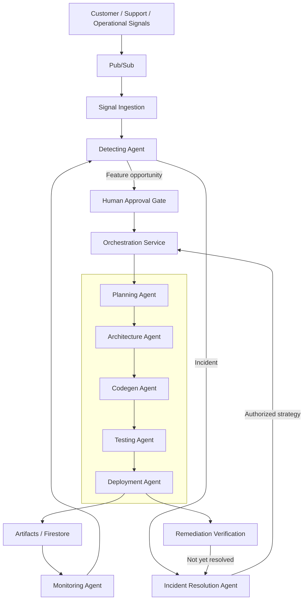
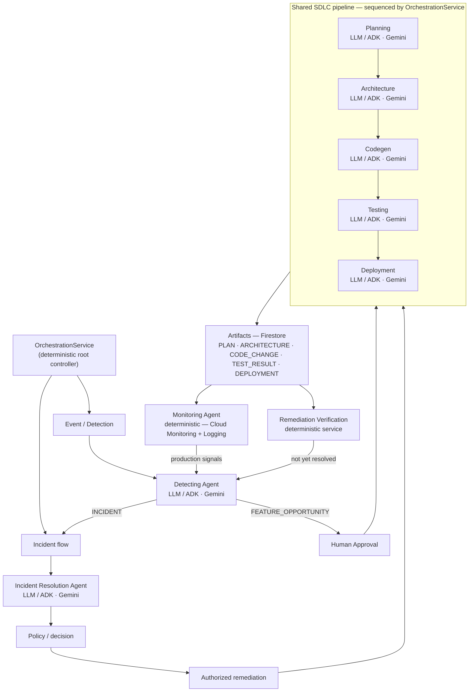
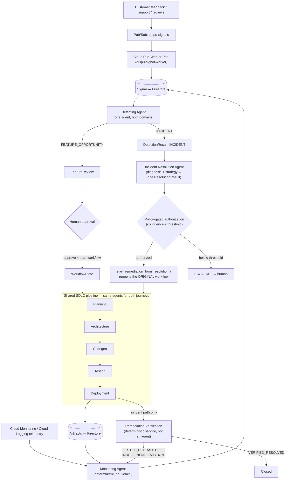
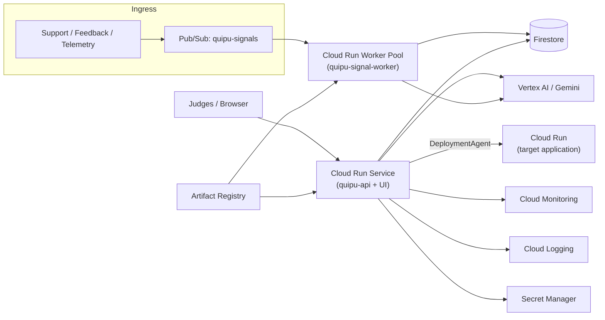
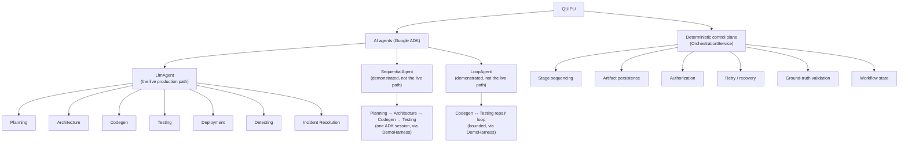

# Quipu

An agentic control plane that turns customer/operational signals into validated, tested, deployed engineering work — and closes the loop back from production incidents into remediation.

**Repository**: https://github.com/RaHuL-SrIrAM-E/Quipu.ai

Most AI developer tools start with a ticket and generate code. **Quipu starts before the ticket** — with the raw signal that explains *why* engineering work should exist — and continues *after* deployment, using fresh production evidence to decide whether the problem is actually solved. The story in one line: **specialized AI companions + deterministic orchestration + persistent artifact lineage + evidence-first validation + explicit human decision boundaries.**


*A simplified view for readability — "Remediation Agent" and "Incident Mgmt Agent" above represent a flow, not separate agent classes. See [Agent companions](#agent-companions) and [Signal journeys](#signal-journeys) for the precise, code-accurate mapping.*

---

## Table of contents

1. [Overview](#overview)
2. [The problem](#the-problem)
3. [The solution](#the-solution)
4. [Agent companions](#agent-companions)
5. [How users interact with Quipu](#how-users-interact-with-quipu)
6. [Signal journeys](#signal-journeys)
7. [Human-in-the-loop](#human-in-the-loop)
8. [Workflow / orchestration](#workflow--orchestration)
9. [Artifact lineage & evidence-first validation](#artifact-lineage--evidence-first-validation)
10. [Retry / recovery](#retry--recovery)
11. [Knowledge layer](#knowledge-layer)
12. [Google Cloud architecture](#google-cloud-architecture)
13. [Google ADK / agent implementation](#google-adk--agent-implementation)
14. [What is real, what is demo, and what remains](#what-is-real-what-is-demo-and-what-remains)
15. [End-to-end demo](#end-to-end-demo)
16. [Repository structure](#repository-structure)
17. [Reproducibility / spin-up](#reproducibility--spin-up)
18. [Environment variables](#environment-variables)
19. [API endpoints](#api-endpoints)
20. [Safety / security](#safety--security)
21. [Testing / validation](#testing--validation)
22. [Limitations / roadmap](#limitations--roadmap)
23. [Why Quipu](#why-quipu)
24. [Hackathon reproducibility checklist](#hackathon-reproducibility-checklist)

---

## Overview

Quipu is an **agentic product-to-production control plane**. It turns signals from customers, support tickets, and production telemetry into validated engineering workflows, and coordinates a set of specialized AI agents — each backed by Gemini via Google ADK — through the full lifecycle those workflows require:

```
Business signal → Detection → Human approval → Planning → Architecture
    → Code generation → Testing → Deployment → Verification / monitoring
    → Incident response → Remediation
```

Quipu is **not a coding agent**, and it is not "an AI that replaces the engineering team." A coding agent starts at "here is a ticket, write the code." Quipu starts earlier — at the raw signal that a ticket should exist at all — and stays engaged after code ships, watching production for evidence that the change actually worked. The differentiator is the **complete lifecycle**, the **coordination contract between specialized agents**, and a deterministic orchestration layer that never lets any single agent's self-report be the final word on whether something actually happened.

## The problem

- Product, customer, and support signals are fragmented across tools — nothing correlates a support ticket, a feedback form entry, and a telemetry anomaly into one picture.
- Real feature opportunities and operational issues stay buried in that fragmented feedback instead of becoming engineering work.
- Turning a validated opportunity into shipped code requires many manual handoffs: PM → architect → developer → QA → DevOps/SRE, each in a different tool.
- Production incidents create a second, disconnected loop: someone has to notice, investigate, decide, and only then trigger the same engineering machinery again.
- The result is a persistent gap between **"a customer told us something"** and **"engineering safely acted on it"** — bridged today almost entirely by manual triage and handoffs.

## The solution

Quipu is an event-driven control plane spanning that entire gap, with one orchestration layer coordinating every stage and an explicit human decision boundary before anything customer-facing (or anything production-mutating) proceeds:

```
                    ┌──────────────────────┐
                    │  Customer / Support   │
                    │ / Production Signal   │
                    └───────────┬───────────┘
                                ↓
                             Pub/Sub
                                ↓
                     Cloud Run Worker Pool
                                ↓
                            Firestore
                                ↓
                      ┌──────────────────┐
                      │  Detecting Agent │
                      └────────┬─────────┘
                        ┌──────┴──────┐
                        ↓             ↓
                   FEATURE       INCIDENT
                        ↓             ↓
                Human approval   Incident Resolution Agent
                        ↓             ↓
                        └──────┬──────┘
                               ↓
                     Orchestration Service
                               ↓
                  Planning → Architecture
                               ↓
                      Codegen → Testing
                               ↓
                          Deployment
                               ↓
                  Monitoring / Verification
                               ↓
                        Production loop
```

The **event-driven ingestion** side (Pub/Sub → `SignalConsumerWorker` → `SignalIngestionService`) is fully decoupled from the **orchestration** side (`OrchestrationService` driving `WorkflowState` through its stages) — a `Signal` existing never implies a workflow will be created; that only happens after Detection classifies it and, for product opportunities, a human approves it. The same five SDLC agents (Planning → Architecture → Codegen → Testing → Deployment) execute for **both** a fresh feature and an authorized incident remediation — there is no separate, duplicated "incident coding stack."



### Control plane view

Another way to read the same architecture: `OrchestrationService` is a single **deterministic root controller** — it never reasons about anything itself, it only decides which stage runs next, based on `WorkflowState.current_stage` and each stage's real result. Everything under it either detects/proposes (the LLM agents) or executes deterministically (Monitoring, Verification, the SDLC stage sequencing itself):



### Component classification

| Component | Type | What it does |
|---|---|---|
| `OrchestrationService` | 🧠 Deterministic controller | Root controller — decides which stage runs next, from real `WorkflowState`/artifact results, never from a model's opinion |
| `DetectingAgent` | 🤖 LLM / Google ADK | Converts accumulated signals into a feature opportunity or an incident conclusion |
| `PlanningAgent` | 🤖 LLM / Google ADK | Turns an approved ticket into an actionable engineering plan |
| `ArchitectureAgent` | 🤖 LLM / Google ADK | Designs the technical change (files/modules to touch) |
| `CodegenAgent` | 🤖 LLM / Google ADK | Generates the code change (real mode) or a deterministic stand-in (demo mode) |
| `TestingAgent` | 🤖 LLM / Google ADK | Decides test strategy; the pass/fail verdict itself is always deterministic, from the real test run |
| `DeploymentAgent` | 🤖 LLM / Google ADK | Proposes deployment configuration and performs a real Cloud Run deployment (real mode) or a clearly-labeled simulated one (demo mode — see [What is real, what is demo, and what remains](#what-is-real-what-is-demo-and-what-remains)) |
| `IncidentResolutionAgent` | 🤖 LLM / Google ADK | Diagnoses an incident and proposes a remediation strategy — never executes it |
| `MonitoringAgent` | ⚙️ Deterministic (no LLM) | Reads Cloud Monitoring/Logging and creates `Signal`s |
| `RemediationVerificationService` | ⚙️ Deterministic service (not an agent) | Checks fresh post-deployment telemetry to determine whether remediation actually resolved the incident |
| Planning → Architecture → Codegen → Testing → Deployment | ➡️ Sequential | The ordered SDLC stages, sequenced by `OrchestrationService` |
| Monitoring → Detection → Remediation → Verification | 🔄 Closed loop | Production feedback can feed back into the same engineering lifecycle |
| Per-agent retry/replan decisions | 🔄 Bounded loop | `OrchestrationService`'s own decision policy, bounded by `max_codegen_retries`/`max_test_retries`/`max_architecture_replans`/`max_deployment_retries` |
| `POST /workflows/{id}/retry` | 🔄 Recovery loop | Reopens the same `FAILED` workflow at its failed stage — see [Retry / recovery](#retry--recovery) |

## Agent companions

Quipu has **8 real, live agent classes** — no more, no fewer. Each is framed as a specialized AI **companion** to a human role, operating inside a controlled workflow, never as an autonomous replacement for that role:

| Human role | Agent | What the human/system gives it | What it produces | Deterministic or LLM-driven? |
|---|---|---|---|---|
| Product Manager / Product Ops | **Detecting Agent** (`detecting.py`) | A bounded, already-persisted set of `Signal`s | `DetectionResult` (`FEATURE_OPPORTUNITY`, `INCIDENT`, or `NO_ACTION`) | LLM (Gemini), with citations verified against real evidence |
| Product Manager / Engineering Manager | **Planning Agent** (`planning.py`) | An approved `Ticket` | `PLAN` artifact + a real Jira ticket | LLM |
| Software Architect / Senior Developer | **Architecture Agent** (`architecture.py`) | `PLAN` artifact | `ARCHITECTURE` artifact (files/modules to touch) | LLM |
| Developer | **Codegen Agent** (`codegen.py`) | `ARCHITECTURE` artifact | `CODE_CHANGE` artifact, real file writes in a cloned workspace | LLM (or demo mode — see [below](#what-is-real-what-is-demo-and-what-remains)) |
| QA / Developer | **Testing Agent** (`testing.py`) | `CODE_CHANGE` artifact | `TEST_RESULT` artifact, from an actual `pytest` run | LLM decides strategy; **pass/fail verdict is deterministic**, from the real test run |
| DevOps / Platform Engineering | **Deployment Agent** (`deployment.py`) | `CODE_CHANGE` artifact (tested) | `DEPLOYMENT` artifact, from a real Cloud Run Admin API call | LLM proposes config; **success/failure is deterministic**, from Cloud Run's own terminal condition |
| SRE / Operations | **Monitoring Agent** (`monitoring.py`) | Cloud Monitoring/Logging queries | `Signal`s derived from real production telemetry | **Fully deterministic — no Gemini call at all**, by design |
| SRE / Incident Commander | **Incident Resolution Agent** (`incident_resolution.py`) | `DetectionResult` (INCIDENT) + evidence `Signal`s | `ResolutionResult` — diagnosis + a recommended, policy-gated remediation strategy | LLM proposes; **authorization is a deterministic policy check**, never trusted from the model alone |

Quipu coordinates these companions through **deterministic orchestration** (`OrchestrationService`), **persisted artifacts** (never hidden conversational state), **explicit decision boundaries** (human approval, policy-gated authorization), and **evidence-first validation** (application code re-verifies what actually happened, every time — see [Artifact lineage & evidence-first validation](#artifact-lineage--evidence-first-validation)).

**On "Incident Management"**: Quipu does not ship a single monolithic "Incident Management Agent," a separate "Remediation Agent," a separate "Diagnosis Agent," or a "Postmortem Agent" — none of these exist in the codebase, despite appearing in some earlier draft diagrams for this submission. Incident handling is a *flow* across three of the agents above: Monitoring observes, Detecting classifies an anomaly as an incident, and Incident Resolution diagnoses it and proposes (never executes) a remediation strategy. `OrchestrationService.start_remediation_from_resolution()` is the deterministic application code that turns an authorized `ResolutionResult` into re-executed Architecture/Codegen/Testing/Deployment stages — **the same agents used for feature work, reused for remediation rather than duplicated.**

There is also a legacy, unused stub package at `app/orchestrator/` (singular — note the different module name from the real `app/orchestration/`) containing placeholder classes (`app/agents/coding.py`, `devops.py`, `incident_management.py`, `feature_detection.py`, each ~13–78 lines, `TODO`-only bodies). It is not imported by `app/main.py` or any API route and is not part of the live system — mentioned here only for completeness when reading the repository tree.

## How users interact with Quipu

Quipu is not merely a backend collection of agents — it ships a real React control-plane UI (`ui/`) and the FastAPI control plane it talks to is a genuine programmatic API in its own right. **The API is the programmatic control plane; the UI is the human-facing control surface** built entirely on top of it (no UI-only logic — every UI action is a plain call to a documented endpoint).

| Step | What the user does | UI page / component | Underlying API call |
|---|---|---|---|
| 1. Observe incoming signals | Browse ingested signals from customers, support, and telemetry | `/signals` (**Signals**) | `GET /signals` |
| 2. Review detected feature opportunities | See what Detecting Agent concluded, with confidence/rationale/supporting signals | `/detections` (**Detection Center**) | `GET /detections` |
| 3. Human approval | Approve or reject a pending feature opportunity | `/feature-reviews` (**Feature Review Queue**) | `POST /feature-reviews/{id}/approve` \| `/reject` |
| 4. Start workflow | Turn an approved review into a real `WorkflowState` | **API only today** — see note below | `POST /feature-reviews/{id}/start-workflow` |
| 5. Watch workflow stages progress | See `current_stage`/`status` advance live | `/workflows` (**Workflows**), `/workflows/:id` (**Workflow Detail**) | `GET /workflows`, `GET /workflows/{id}`, `POST /workflows/{id}/step` \| `/run` |
| 6. Inspect artifact lineage | See the PLAN → ARCHITECTURE → CODE_CHANGE → TEST_RESULT → DEPLOYMENT chain, with "Demo execution" badges where applicable | **Workflow Detail** → "Artifact Lineage" panel | `GET /workflows/{id}/artifacts` |
| 7. See decisions / executions / evidence | See every agent execution (status, retries, errors) and every orchestrator decision (action, confidence, reason) | **Workflow Detail** → "Agent Executions" / "Orchestrator Decisions" panels | `GET /workflows/{id}/executions`, `GET /workflows/{id}/decisions` |
| 8. Retry a failed workflow | Reopen a `FAILED` workflow at the exact stage it failed | **Workflow Detail** → "↻ Retry" button | `POST /workflows/{id}/retry` |
| 9. View incident detections / resolutions | Browse diagnosed incidents and their recommended strategy | `/resolutions` (**Incidents**), `/resolutions/:id` (**Incident Diagnosis**) | `GET /resolutions`, `GET /resolutions/{id}` |
| 10. Authorize remediation | Turn an incident diagnosis into a re-executed engineering workflow | **Incident Diagnosis** → "Authorize Remediation" button | `POST /resolutions/{id}/remediate` |
| 11. Observe remediation verification | See the `Deployment Success ≠ Verified Resolved` distinction and the actual outcome | **Incident Diagnosis** → "Verification Result" panel, `/verifications` (**Verifications**) | `GET /verifications`, `GET /verifications/{id}` |

There's also a **Command Center** (`/`, the root route) that surfaces the live workflow timeline, recent signals/detections, the pending feature-review queue, active incidents/remediations, and verification status all in one dashboard — the first thing a judge sees.

**A real, honest UI gap worth stating plainly**: step 4 above (starting a workflow from an approved review) is **not currently exposed as a button in the UI** — `FeatureReviews.tsx` only wires Approve/Reject; `POST /feature-reviews/{id}/start-workflow` exists and works, but today it's called directly (`curl`, `/docs`), not from a UI click. This is a small, known frontend gap, not a missing backend capability — listed again under [Limitations / roadmap](#limitations--roadmap).

## Signal journeys

The same `DetectingAgent` and the same five-stage SDLC pipeline handle both journeys — Quipu does not run a separate, duplicated agent stack for each.

### Journey A — Feature opportunity

```
Customer/support feedback
  → Pub/Sub (quipu-signals)
  → Cloud Run Worker Pool (quipu-signal-worker)
  → Firestore (Signal)
  → Detecting Agent → FEATURE_OPPORTUNITY
  → FeatureReview (PENDING)
  → Human approval
  → WorkflowState created
  → Planning → Architecture → Codegen → Testing → Deployment
  → Monitoring
```

### Journey B — Production incident

```
Cloud Monitoring / Cloud Logging telemetry
  → Monitoring Agent → Signal
  → Detecting Agent → INCIDENT
  → Incident Resolution Agent → ResolutionResult (diagnosis + strategy)
  → Policy-gated authorization (confidence ≥ threshold, or ESCALATE)
  → start_remediation_from_resolution() reopens the ORIGINAL workflow
  → Architecture → Codegen → Testing → Deployment
  → Remediation Verification (fresh telemetry, not deployment success)
  → Resolved / still degraded → back to Monitoring
```



**Why reusing the same pipeline matters architecturally**: there is no separate "incident coding stack." A production incident feeds back into the exact same controlled engineering lifecycle a feature request goes through — same evidence-first Testing/Deployment gates, same artifact lineage, same retry mechanism, same capability-gated tools. Quipu doesn't have two products bolted together; it has one control plane with two entry points.

Deliberately absent from the diagram above (because they don't exist in the codebase, despite appearing in some earlier draft diagrams for this submission): a separate "Incident Detection Agent" (it's the same `DetectingAgent` for both domains), separate "Diagnosis"/"Decision"/"Remediation"/"Verification"/"Postmortem" agents, a separate "Incident Orchestrator" (one `OrchestrationService` drives both journeys), and dedicated `DIAGNOSIS`/`DECISION`/`REMEDIATION`/`VERIFICATION`/`POSTMORTEM` artifact types (the real `ArtifactType` enum has none of these — see [Workflow / orchestration](#workflow--orchestration)).

### The closed production loop

Stripped down to the essential shape, the two journeys are one loop, not two separate systems:

```
                 FEATURE JOURNEY
                       │
Signal → Detect → Human approval → SDLC → Production
                                              │
                                              ▼
                                     Monitoring Agent
                                              │
                                              ▼
                                     INCIDENT JOURNEY
                                              │
                                    Detect → Diagnose
                                              │
                                              ▼
                                   Authorized remediation
                                              │
                                              ▼
                                  SAME SDLC PIPELINE
                                              │
                                              ▼
                                        Verification
                                              │
                             ┌────────────────┴────────────────┐
                             ▼                                 ▼
                        RESOLVED                        STILL DEGRADED
                             │                                 │
                           Closed                    Monitor again ──┐
                                                                      │
                                                    ◄─────────────────┘
```

`VerificationOutcome` also has `INSUFFICIENT_EVIDENCE` (never treated as success — see [Artifact lineage & evidence-first validation](#artifact-lineage--evidence-first-validation)) and `ESCALATED` (verification itself hit a condition needing human attention), both of which route back to "monitor again" the same way `STILL_DEGRADED` does — this diagram shows the two outcomes that matter most for the story, not the full enum.

## Human-in-the-loop

For product opportunities, Quipu never turns arbitrary feedback directly into a running workflow:

```
Signal(s) → Detecting Agent → FeatureReview (PENDING) → Human approval → start-workflow → WorkflowState
```

`POST /feature-reviews/{id}/approve` requires a real reviewer identity (`app/api/auth.py:require_reviewer_identity` — never an agent-supplied value), and even after approval, `POST /feature-reviews/{id}/start-workflow` is a **separate, explicit** call — approving an opportunity and starting engineering work are deliberately two different actions, not one.

For incidents, the equivalent boundary is authorization of a `ResolutionResult`: `IncidentResolutionAgent` never executes anything itself, and `OrchestrationService.start_remediation_from_resolution()` re-derives authorization deterministically from the persisted strategy/risk (never trusting `resolution.target_agent` blindly) before reopening the original workflow. A resolution whose confidence falls below `incident_resolution_min_confidence_for_auto_remediation` (default `0.7`) is downgraded to `ESCALATE` regardless of what the model proposed.

## Workflow / orchestration

`WorkflowState` (`app/domain/workflow.py`) is the single source of truth for one engineering run:

```python
workflow_id: str
ticket: Ticket
status: WorkflowStatus        # pending | running | waiting | completed | failed | blocked | cancelled | escalated
current_stage: WorkflowStage  # planning | architecture | codegen | testing | deployment | monitoring | detection | incident_resolution | completed
artifact_ids: list[str]
active_decision_id: str | None
execution_ids: list[str]
active_incident_ids: list[str]
metadata: dict[str, Any]
version: int                  # optimistic concurrency
```

`OrchestrationService.execute_next_step()` advances exactly one stage at a time, fetching each stage's required upstream artifact, invoking the corresponding agent, and persisting the resulting `Artifact` before moving `current_stage` forward. `run_to_completion()` (used by `POST /workflows/{id}/run`) is the same loop, bounded by `workflow_run_max_iterations` (default 20) so one HTTP request can never become an unbounded loop. A failure at any stage sets `status=FAILED` and leaves `current_stage` exactly where it failed, ready for retry.

## Artifact lineage & evidence-first validation

Every stage produces a persisted `Artifact` — agents never hand work to each other through hidden conversational state. Each downstream agent consumes the **actual persisted upstream artifact** (via `ArtifactGateway`/`context.artifacts`), and `parent_artifact_ids` links each artifact back to the one it was derived from:

```
PLAN
  ↓  (parent_artifact_ids)
ARCHITECTURE
  ↓
CODE_CHANGE
  ↓
TEST_RESULT
  ↓
DEPLOYMENT
```

Why this matters:

- **Traceability** — every workflow's `artifact_ids` list is a complete, ordered record of what was produced and when.
- **Reproducibility** — a downstream agent's input is always a specific, versioned, persisted artifact — never a transient conversation state that disappears when the process restarts.
- **Auditability** — the UI's "Artifact Lineage" panel (Workflow Detail) renders this chain directly from Firestore, including which artifacts were produced in [demo mode](#what-is-real-what-is-demo-and-what-remains).
- **No hidden agent-to-agent conversation** — agents never call each other directly; they only ever read/write through the artifact abstraction and the deterministic `OrchestrationService`.

### Artifact structure

Every `Artifact` (`app/domain/artifact.py`) has exactly this shape — the same schema for every stage, every agent, both journeys:

```python
class Artifact(BaseModel):
    artifact_id: str                     # uuid4, generated on creation
    artifact_type: ArtifactType          # ticket | plan | architecture | code_change
                                          # | test_result | deployment | monitoring
                                          # | incident | resolution
    version: int                         # optimistic concurrency, starts at 1
    created_by: str                      # the agent_id that produced it, e.g. "codegen_agent"
    created_at: datetime
    parent_artifact_ids: list[str]       # the lineage pointer(s) — usually one upstream artifact
    status: WorkflowStatus               # completed | failed | ...
    payload: dict[str, Any]              # the agent's own structured output, e.g. DeploymentOutput
```

Example — a `DEPLOYMENT` artifact produced in demo mode (fields trimmed for readability; `raw_deployment_results` and the full `DeploymentOutput` fields are also present in a real payload):

```json
{
  "artifact_id": "6f2b6b0e-...-b1a2",
  "artifact_type": "deployment",
  "version": 1,
  "created_by": "deployment_agent",
  "created_at": "2026-08-31T09:12:44Z",
  "parent_artifact_ids": ["c14d9e0a-...-77f0"],
  "status": "completed",
  "payload": {
    "deployment_summary": "Simulated deployment of the tested change...",
    "service_name": "karate-automation-tester",
    "region": "us-central1",
    "status": "succeeded",
    "execution_mode": "demo",
    "raw_deployment_results": [{ "simulated": true, "uri": null }]
  }
}
```

`payload` is `Artifact`'s only free-form field — there is no separate metadata field, which is exactly why the demo-mode marker lives at `payload.execution_mode` rather than a dedicated schema addition (see [What is real, what is demo, and what remains](#what-is-real-what-is-demo-and-what-remains)).

**Evidence-first is one of Quipu's core architectural differentiators.** The pattern repeats across every agent that can affect the outside world: the model *proposes* an action or a result, but the persisted verdict is always **recomputed by application code from what actually happened** — never trusted from the model's own narration:

- `DetectingAgent` verifies `supporting_signal_ids` against the actual evidence set it was given — a fabricated citation is caught, not trusted.
- `TestingAgent._ground_truth_status()` computes pass/fail from the real `run_tests` execution record, not from whatever the model's `overall_status` claims.
- `DeploymentAgent._ground_truth_status()` computes success/failure from the real Cloud Run Admin API's `terminal_condition`, not from the model's own success claim.
- `RemediationVerificationService` checks **fresh post-deployment telemetry** before ever concluding `VERIFIED_RESOLVED` — a successful deployment is *never*, by itself, treated as proof the incident is resolved (`VerificationOutcome` also has `STILL_DEGRADED`, `INSUFFICIENT_EVIDENCE` — never treated as success — and `ESCALATED`).

## Retry / recovery

A failed workflow is **reopened**, not duplicated:

```
Workflow FAILED
      ↓
POST /workflows/{workflow_id}/retry
      ↓
Workflow PENDING  (same workflow_id, same current_stage, same artifact_ids/execution_ids)
      ↓
POST /workflows/{workflow_id}/run  (or /step)
      ↓
resume at the failed stage → continue the pipeline
```

`retry_failed_workflow()` (`app/orchestration/service.py`) only flips `status` back to `PENDING` and increments a `retry_count` in metadata — `current_stage`, `artifact_ids`, and `execution_ids` are untouched, so already-successful upstream artifacts (Plan, Architecture, …) are **never regenerated**. `FeatureReview.workflow_id` is never modified, so the review-to-workflow pointer stays stable across any number of retries. The write is concurrency-safe via `WorkflowRepository.update_if_version` — of two simultaneous retries, exactly one wins.

**What actually happened during this submission's live E2E run**: Codegen and Testing were run in their deterministic [demo modes](#what-is-real-what-is-demo-and-what-remains) for hackathon reliability, and the workflow reached Deployment. Deployment then failed **honestly**, with a real configuration error (`DEPLOYMENT_CONFIGURATION_MISSING: CLOUD_RUN_IMAGE_REGISTRY is not configured`) — not a fabricated success. `POST /workflows/{id}/retry` reopened the **same** `workflow_id` at the `deployment` stage; no new workflow was created, and Planning/Architecture's artifacts were not regenerated. After `DEPLOYMENT_DEMO_MODE=true` was configured, re-running the same workflow completed it successfully — via Deployment's demo path, **not** a real Cloud Run mutation of the target application (see [What is real, what is demo, and what remains](#what-is-real-what-is-demo-and-what-remains) for exactly what that does and doesn't claim).

**Honest limitation**: `retry_count` is tracked but **not currently capped** — there is no maximum-retry ceiling enforced by `retry_failed_workflow()` itself (unlike the per-agent `max_codegen_retries`/`max_test_retries`/`max_deployment_retries` the orchestrator's own automatic decision loop already enforces). This is a documented gap, not a hidden one.

## Knowledge layer

Quipu has a real retrieval abstraction that every LLM-backed agent can call — grounding, not a fictional RAG pipeline, and worth being precise about what's wired in versus what's real-but-unwired.

- **`RetrievalBackend`** (`app/knowledge/backend.py`) is a `Protocol` — the abstraction `KnowledgeService` depends on, so a real search engine can be swapped in without touching `KnowledgeService` or any agent-facing code.
- **`KnowledgeGateway`** (`app/agent_runtime/gateways/knowledge.py`) is the thin, agent-facing interface: `search(request) -> list[KnowledgeItem]`. Agents never see chunk-level provenance or ranking internals — only the final ranked items.
- **`query_enterprise_knowledge`** (`app/tools/knowledge_tools.py`) is the actual ADK tool every LLM-backed agent has access to (`PlanningAgent`, `ArchitectureAgent`, `CodegenAgent`, `TestingAgent`, `DeploymentAgent`, `DetectingAgent`, `IncidentResolutionAgent` — confirmed by grep, all seven). It's **on-demand, not auto-injected** into every prompt: the model decides whether a query would help and calls the tool itself. Each agent's allowed `knowledge_type`s are scoped by `app/knowledge/policies/AGENT_RETRIEVAL_PROFILES` — an agent can't request knowledge outside its own profile.
- **Current default backend, wired into the live API container** (`app/api/container.py`): `InMemoryRetrievalBackend(documents=[], chunks=[])` — the real gateway/service chain **is** connected end-to-end in the live request path, but seeded with **zero documents** by default, so a query returns an empty result today unless a caller/test seeds documents into it.
- **Google Agent Search / Discovery Engine** (`app/knowledge/backends/google_search.py`) is a real, independently tested implementation of the same `RetrievalBackend` protocol (`tests/test_knowledge_platform.py`) — but it is **not** the backend `app/api/container.py` constructs by default. Confirming the exact, previously-stated distinction: **the default `KnowledgeGateway` is an in-memory backend; wiring the real Discovery Engine backend is listed under [Limitations / roadmap](#limitations--roadmap).**

In short: the knowledge *plumbing* (protocol, gateway, tool, per-agent policy, ranking) is real and connected; the *content* behind it today is empty by default, and the Google-native retrieval backend exists and is tested but is not the one currently plugged in.

## Google Cloud architecture

Every service below was verified directly against the live project `quipu-507109` (`us-central1`) via `gcloud`, not assumed from documentation. Each row explains **why** the service is part of the architecture, not just that it's used.

| Service | Why it's here |
|---|---|
| **Cloud Run (Service)** — `quipu-api` | Hosts Quipu's *own* Control Plane API and the built React UI as one deployable unit. This is the thing judges load in a browser. |
| **Cloud Run (Worker Pool)** — `quipu-signal-worker` | Runs the long-lived Pub/Sub signal consumer. A worker pool (not a request-driven Service) is the right fit because `SignalConsumerWorker` is a pull-loop with no inbound HTTP traffic — a distinct GCP product from Cloud Run Services, used for exactly the shape it was built for. |
| **Cloud Run Admin API (target applications)** | What `DeploymentAgent` calls to deploy the *target* application Quipu is building/fixing — architecturally distinct from Quipu's own hosting above. This is Quipu deploying someone else's app, not itself. |
| **Pub/Sub** | The event-transport boundary that decouples "a signal arrived" from "a workflow was created" — `quipu-signals` topic, `quipu-signals-sub` subscription, `quipu-signals-dlq` dead-letter topic for messages that repeatedly fail processing. |
| **Firestore (Native mode)** | Durable state for every domain entity — `workflows/{id}/{artifacts,executions,decisions}`, `signals/`, `detections/`, `resolutions/`, `remediation_verifications/`, `feature_reviews/`. This is what makes artifact lineage and retry possible at all: nothing lives only in a process's memory. |
| **Vertex AI (Gemini, via Google ADK)** | The reasoning engine for every LLM-backed agent — always through ADK's `LlmAgent`, always with a structured output schema, never a raw chatbot call (see [Google ADK / agent implementation](#google-adk--agent-implementation)). |
| **Artifact Registry** | Stores the Docker images for both the API (`quipu/api`) and worker (`quipu/worker`) — the images Cloud Run and the Worker Pool actually run. |
| **Cloud Build / local Docker** | The build step that produces those images. This project currently builds/pushes with local `docker build`/`docker push` rather than `gcloud builds submit`, because the project's Cloud Build default service account is missing storage permissions — a documented, real gap, not silently worked around (see [Google Cloud deployment](#reproducibility--spin-up)). |
| **Cloud Monitoring** | What `MonitoringAgent` actually queries to observe real production metrics — the "watch production" half of the closed loop. |
| **Cloud Logging** | What `MonitoringAgent` queries for log-based evidence (error rates, specific log entries) — the other half of that same observation. |
| **Secret Manager** | Backs the `jira-api-token` secret injected into `quipu-api`'s environment — the one credential in this system that isn't ADC-resolved, kept out of plain environment-variable text. |
| **Jira** | Where `PlanningAgent` creates a real engineering ticket for an approved feature opportunity — the artifact that gives a `WorkflowState.ticket` a real paper trail outside Quipu itself, when configured. |

Every Google client (`app/core/*_client.py`, `app/persistence/firestore/*.py`, `app/eventing/google_pubsub_client.py`) constructs its SDK client with **zero explicit credentials** — authentication is Application Default Credentials via each service's attached identity (`quipu-api-sa`, `quipu-worker-sa`), never a downloaded service-account JSON key.



## Google ADK / agent implementation

Quipu is **not** "calling Gemini from one generic chatbot loop." Every LLM-backed agent (`PlanningAgent`, `ArchitectureAgent`, `CodegenAgent`, `TestingAgent`, `DeploymentAgent`, `DetectingAgent`, `IncidentResolutionAgent`) follows the same, deliberately constrained internal shape:

- A `QuipuAgent` subclass (`app/agent_runtime/base.py`) owns identity, a declared `set[AgentCapability]`, `AgentExecution`/`AgentMetrics` bookkeeping, and artifact persistence — this is what `OrchestrationService` actually calls. The ADK agent underneath is an implementation detail this wrapper controls, not the other way around.
- Internally, it constructs a real Google ADK `LlmAgent(model=settings.gemini_model, output_schema=<PydanticModel>, tools=[...])` and drives it through an `InMemoryRunner`, wrapped in `with_timeout()` (`app/core/resilience/timeout.py`) so a hung Gemini/tool-calling conversation can never hang a workflow stage indefinitely. Each agent has its **own dedicated timeout setting** (e.g. `deployment_llm_call_timeout_seconds=360.0` vs. `codegen_llm_call_timeout_seconds=120.0`) rather than one shared bound, because a `pytest` run and a Cloud Run deploy genuinely need different budgets.
- Every agent returns a **structured Pydantic output schema** via ADK's `output_schema=` (e.g. `DeploymentOutput`, `TestingOutput`, `DetectionResult`) — never freeform text parsed by regex.
- **Tools are capability-gated**: `before_tool_callback=_tool_capability_gate` checks `tool_context.state["_capabilities"]` before any tool call is allowed to execute (`app/agent_runtime/capabilities.py`). An agent can only call tools its declared `capabilities` property actually grants — this is enforced structurally, not by asking the model nicely.
- **Evidence-first / ground-truth validation** (detailed in [Artifact lineage & evidence-first validation](#artifact-lineage--evidence-first-validation)) is layered on top of ADK's own tool-calling loop: the model proposes a tool call; the tool's *actual* result — a real `pytest` run, a real Cloud Run Admin API response, a real evidence-set check — is what application code persists, never the model's narration of it.
- Artifacts flow between agents exclusively through `ArtifactGateway`/`context.artifacts` (never raw ADK session state across agent boundaries) — `Artifact.payload` and `parent_artifact_ids` form the lineage chain the UI renders.
- `MonitoringAgent` is the deliberate exception: it has **no ADK `LlmAgent` at all**. Turning a Google Monitoring/Logging API response into a `Signal` is a mechanical transformation, not a reasoning task — using Gemini for it would just be more latency and cost for no benefit, so it doesn't.

### Which ADK agent type is used where

This is a story worth being precise about, because it's more interesting than "one LLM agent type everywhere" — Quipu's codebase actually constructs **three different ADK agent types**, but they don't all sit on the same execution path, and the README should not blur that distinction:

| ADK agent type | Where it's built | What it does | Is it the live production execution path? |
|---|---|---|---|
| `LlmAgent` | Once per reasoning agent, in `app/agents/{planning,architecture,codegen,testing,deployment,detecting,incident_resolution}.py` | Gemini reasoning + a structured output schema + capability-gated tools, per agent | **Yes** — every real (non-demo-mode) agent invocation, in every environment, goes through its own `LlmAgent` |
| `SequentialAgent` | `app/orchestration/adk/sequential.py::build_happy_path_sequential_agent()` | Wraps the same Planning→Architecture→Codegen→Testing `QuipuAgent`s (via `QuipuAgentAdkAdapter`) into one real ADK sequential composition | **No** — real, tested, constructed code, but only exercised by `DemoHarness`/tests today, not by the live API's `/step` or `/run` |
| `LoopAgent` | `app/orchestration/adk/loop.py::build_recovery_loop_agent()` | A bounded Codegen ↔ Testing repair loop (uses ADK's `EventActions.escalate` to stop on a pass or a non-fixable failure classification), capped by `orchestration_loop_max_iterations` | **No** — same as above: real and tested, exercised by `DemoHarness`, not the live request path |
| *(no ADK agent)* | `app/agents/monitoring.py`, `app/verification/` | Deterministic Python — no Gemini call at all | Yes, deterministically, by design |



**Why the production API doesn't run the `SequentialAgent`/`LoopAgent` path**: `OrchestrationService.execute_next_step()` — the actual mechanism behind `/step`, `/run`, and `/retry` — writes a durable Firestore update after **every single stage**, so a crashed process resumes exactly where it left off. Running the whole happy path as one ADK `SequentialAgent` session is a single synchronous call that loses that per-stage resumability if the process dies mid-sequence (see `docs/architecture/orchestration.md`, "SequentialAgent vs. step-wise execution"). Both are real, both are tested — the step-wise path is simply the one actually serving live traffic.

The core architectural claim this all supports: Quipu is not *"a bunch of LLM agents put together"* — it's *"specialized Google ADK agents operating inside a deterministic control plane."* The LLM agents reason and propose; `OrchestrationService` controls what happens next; application code verifies what actually happened. Agents never call each other directly — only through persisted artifacts and this same deterministic layer, consistent with the [evidence-first](#artifact-lineage--evidence-first-validation) pattern throughout this document.

## What is real, what is demo, and what remains

### Live-validated against GCP

- Pub/Sub signal ingestion (`quipu-signals` → `quipu-signal-worker` → Firestore `Signal`)
- `quipu-signal-worker` running as a real Cloud Run Worker Pool
- Firestore persistence for workflows/artifacts/signals/detections/reviews/resolutions/verifications
- `DetectingAgent`'s real Gemini/Vertex AI call producing a `DetectionResult`
- `FeatureReview` creation and human approval
- Real `WorkflowState` creation and orchestration — `Planning` and `Architecture` ran their **real** Gemini/ADK path in this submission's live run (real Jira ticket creation, when configured)
- Workflow retry (`POST /workflows/{id}/retry`) reopening the same workflow in place, verified end-to-end
- Artifact lineage persistence in Firestore, rendered by the deployed UI
- `quipu-api` (Cloud Run Service) and `quipu-signal-worker` (Cloud Run Worker Pool), both live and responding (`/health` → `{"status":"ok"}`, `/ready` → `{"status":"ready"}`)

### Demo-mode for hackathon reliability

`CODEGEN_DEMO_MODE`, `TESTING_DEMO_MODE`, and `DEPLOYMENT_DEMO_MODE` are three **independently controlled** opt-in flags (deliberately not one combined `DEMO_MODE`). **Real execution remains the default in every case (`false`).** All three are currently enabled on the live `quipu-api` deployment — a deliberate, documented choice for this submission, not an accident (verified via `gcloud run services describe`).

What each demo mode **does**:
- Skips the agent's real, multi-turn Gemini/ADK tool-calling conversation (no ADK runner is even constructed).
- Still **consumes the real upstream artifact** (the actual `ArchitectureOutput`/`CodegenOutput` from the previous stage) — the output isn't invented from nothing.
- Still flows through the exact same orchestration and artifact-persistence path a real run uses.
- Marks its output artifact with `payload.execution_mode == "demo"`, which the UI renders as a visible **"Demo execution" badge** — never hidden, never presented as equivalent to a real run.

What each demo mode does **not** claim:
- **Codegen demo mode does not claim real Gemini-authored code changes** — it deterministically derives a plausible `CODE_CHANGE` artifact shape from the real upstream architecture, nothing more.
- **Testing demo mode does not claim a real `pytest` execution** — no subprocess runs; the `TEST_RESULT` artifact is deterministic, not evidence from an actual test run.
- **Deployment demo mode structurally never calls `CloudRunDeployer`/the real Cloud Run Admin API** — enforced in code (the ADK runner and the `deploy_cloud_run` tool are never constructed in that branch), not merely skipped via a prompt instruction. **No Docker image is built or pushed, and no target-application Cloud Run service is created or mutated, ever, in demo mode.** The resulting `DEPLOYMENT` artifact is explicitly marked `execution_mode: "demo"` with a `simulated: true`, no-URI result.

These flags exist because the target repository used for this submission's demo (`karate-automation-tester`) is not, today, containerized/build-pushed by any pipeline in this codebase — see below.

### Implemented but not fully live-validated

- **Target-repository containerization / image build+push**: no pipeline in this codebase builds a Docker image from a workflow's modified workspace and pushes it to Artifact Registry. This is *why* `DEPLOYMENT_DEMO_MODE` exists — the real `DeploymentAgent`/`CloudRunDeployer` code path is real and tested (against a fake deployer in `tests/test_deployment_agent.py`), but has never been exercised end-to-end against a genuinely built image for `karate-automation-tester` or any other target repository. **Deployment does not actually deploy the target application in this submission's demo run** — that is a deliberate, documented scope boundary, not an oversight.
- **Full incident → remediation → verification chain as one continuous live GCP execution**: implemented and covered by `tests/test_incident_remediation.py` and the deterministic `DemoHarness.run_incident_flow()` (`app/demo/harness.py`, exercised by `tests/test_demo_incident_flow.py`), which proves the chain including a *second* remediation cycle whose evidence stays `STILL_DEGRADED`. **This has not been demonstrated as one continuous run against the live, deployed GCP project** in this submission — the live E2E run actually performed and verified against `quipu-507109` exercises the **feature-opportunity** path (Journey A), not the incident-remediation path (Journey B). The incident/remediation capability is real, tested application code; its live-GCP execution is an architectural capability that was not part of the demonstrated run.
- **Agent Search / Discovery Engine**: real client code exists (`app/knowledge/backends/google_search.py`) and is independently tested, but is not the backend wired into the live API's default `KnowledgeGateway` (which uses an in-memory backend with zero documents — see [Knowledge layer](#knowledge-layer)).
- **UI "Start Workflow" button**: `POST /feature-reviews/{id}/start-workflow` is a real, working endpoint, but the UI does not currently expose a button for it (only Approve/Reject) — see [How users interact with Quipu](#how-users-interact-with-quipu).

## End-to-end demo

### What's already deployed (nothing to spin up to watch this)

`quipu-api` (Cloud Run Service, `us-central1`), `quipu-signal-worker` (Cloud Run Worker Pool), the `quipu-signals`/`quipu-signals-dlq` Pub/Sub topics + `quipu-signals-sub` subscription, and the Firestore database are all live in `quipu-507109`. `CODEGEN_DEMO_MODE`, `TESTING_DEMO_MODE`, and `DEPLOYMENT_DEMO_MODE` are all `true` on the live deployment.

### The exact scenario validated live for this submission

1. A signal (customer/support-shaped) is published to the real `quipu-signals` Pub/Sub topic.
2. `quipu-signal-worker` pulls it; `SignalIngestionService` persists a `Signal` to Firestore.
3. `DetectingAgent` correlates accumulated signals via a real Gemini/Vertex AI call and produces a `DetectionResult` (`FEATURE_OPPORTUNITY`).
4. A `FeatureReview` is created; a human reviewer approves it via the API/UI.
5. `POST /feature-reviews/{id}/start-workflow` creates a real `WorkflowState` against the target repository (`karate-automation-tester`).
6. The workflow is advanced (`POST /workflows/{id}/run`) through **Planning → Architecture → Codegen (demo mode) → Testing (demo mode) → Deployment (demo mode)**, reaching `COMPLETED`.
7. **Retry demonstration**: before demo mode was enabled for Deployment, that stage failed on a real, honest configuration error (`DEPLOYMENT_CONFIGURATION_MISSING: CLOUD_RUN_IMAGE_REGISTRY is not configured`). `POST /workflows/{id}/retry` reopened the **same** `workflow_id` at the `deployment` stage — no new workflow was created, no upstream artifact was regenerated — and re-running it after `DEPLOYMENT_DEMO_MODE=true` was configured completed the workflow successfully (Deployment's demo path, not a real target-app Cloud Run mutation).

Publishing a signal yourself (no credentials required for this call):

```bash
gcloud pubsub topics publish quipu-signals --message='{
  "event_type": "customer.feedback.received",
  "source": "support",
  "payload": {"summary": "Customers keep asking for CSV export on the reporting page"}
}'
```

Then watch it arrive: `GET https://quipu-api-608549741775.us-central1.run.app/signals`, then `/detections`, then `/feature-reviews` (or the UI's Signals → Detection Center → Feature Review Queue pages).

### A 4-minute judge walkthrough

| Time | What to show |
|---|---|
| 0:00–0:30 | Problem statement + the architecture diagram (this README's [The solution](#the-solution)) |
| 0:30–1:10 | Publish a signal → watch it appear in Signals → Detection Center |
| 1:10–1:40 | Approve the feature review (Feature Review Queue) → start the workflow |
| 1:40–2:40 | Watch Workflow Detail advance: Planning → Architecture → Codegen → Testing → Deployment, narrating which stages are real Gemini calls vs. clearly-badged demo execution |
| 2:40–3:10 | Artifact Lineage panel — PLAN → ARCHITECTURE → CODE_CHANGE → TEST_RESULT → DEPLOYMENT, and the Agent Executions/Orchestrator Decisions panels as evidence |
| 3:10–3:40 | Retry: show (or narrate) the honest Deployment configuration failure and the retry that resumed the same workflow at the same stage |
| 3:40–4:00 | State clearly that the incident → remediation → verification loop (Journey B) is implemented and tested but was **not** part of this live demo run, then close on the value proposition |

**Do not present the incident/remediation flow as live-demonstrated** — narrate it as an architectural capability backed by real, tested code, exactly as this README does.

## Repository structure

```
app/
  agents/           8 real QuipuAgent-native agents (planning, architecture, codegen,
                     testing, deployment, detecting, monitoring, incident_resolution)
                     + a legacy, unused stub package's agents (coding/devops/
                     incident_management/feature_detection)
  agent_runtime/    QuipuAgent base class, capability enum/gate, identity, context,
                     knowledge gateway protocol
  api/              FastAPI app, routes, schemas, container (dependency wiring), auth
  core/             Google Cloud client adapters (Cloud Run, Monitoring, Logging,
                     resilience/timeout, repo checkout, RBAC)
  demo/             DemoHarness — deterministic, credential-free E2E scenario runner
  detection/        Signal → DetectingAgent orchestration (event-driven trigger policy)
  domain/           Pydantic domain models (WorkflowState, Artifact, Signal,
                     DetectionResult, ResolutionResult, FeatureReview, enums)
  eventing/         Pub/Sub client, SignalConsumerWorker, worker_main entrypoint
  feature_review/   FeatureReviewService (approve/reject/start-workflow)
  knowledge/        RetrievalBackend protocol, KnowledgeService, backends
                     (in-memory, Google Search/Discovery Engine), retrieval policies
  orchestration/    OrchestrationService — the one real orchestration engine
  orchestrator/     legacy, unused SequentialAgent pipeline (not imported by app.main)
  persistence/      Repository implementations — in-memory (tests) + Firestore (prod)
  signals/          Signal adapters, sanitization, ingestion service
  tools/            ADK tool functions (repo, codegen, testing, deployment, jira, knowledge)
  verification/     RemediationVerification service
  config.py         Settings (pydantic-settings) — every environment variable
  main.py           FastAPI app entrypoint
ui/                 React 19 + TypeScript control-plane frontend (Vite, Vitest)
                     src/pages/: Overview (Command Center), Workflows, WorkflowDetail,
                     Signals, Detections, FeatureReviews, Resolutions, ResolutionDetail,
                     Verifications
tests/              Backend test suite (pytest)
docs/
  architecture/     One design doc per subsystem/agent
  deployment/       gcp.md (deployment runbook), gcp_validation.md (validation log)
  hackathon/        submission_readiness.md (internal audit trail)
  images/           architecture-overview.jpeg (the diagram at the top of this README)
Dockerfile          Cloud Run image: Control Plane API + built UI
Dockerfile.worker   Cloud Run Worker Pool image: Pub/Sub signal consumer
firestore.indexes.json   Composite indexes discovered from real query traffic
requirements.txt    Python dependencies
```

## Reproducibility / spin-up

### Fastest local path (no GCP account needed)

```bash
git clone https://github.com/RaHuL-SrIrAM-E/Quipu.ai.git
cd Quipu.ai

python3 -m venv .venv
source .venv/bin/activate        # Windows: .venv\Scripts\activate
pip install -r requirements.txt

cp .env.example .env             # all fields have safe local defaults

uvicorn app.main:app --reload    # API on http://localhost:8000, docs at /docs
```

```bash
cd ui
npm install
npm run dev                      # frontend dev server
```

```bash
# Tests
source .venv/bin/activate && python -m pytest -q
cd ui && npm run test && npm run build   # vitest + tsc -b + vite build
```

**Prerequisites**: Python 3.13 (Docker images pin `python:3.13-slim`), Node.js 22+ (`node:22-slim`), Docker only if building images locally, `gcloud` CLI only if deploying to GCP, a Jira Cloud site + API token only for real ticket creation (optional).

Quipu runs entirely **credential-free locally**: `app/api/container.py::build_default_container()` automatically selects in-memory repositories whenever `GCP_PROJECT_ID` is unset — the exact same code path the full test suite exercises. Nothing reaches a real Google Cloud API from a plain local run.

### Full GCP path

**⚠️ Every command below mutates real Google Cloud resources and can incur billing. Do not run these against a project you don't control.**

Full details, including per-role IAM justification and the Firestore composite-index discovery procedure, are in [`docs/deployment/gcp.md`](docs/deployment/gcp.md) and [`docs/deployment/gcp_validation.md`](docs/deployment/gcp_validation.md). Summary, in order:

```bash
# 1. Project
export PROJECT_ID=<your-project-id>
export REGION=us-central1
gcloud config set project "$PROJECT_ID"

# 2. APIs
gcloud services enable run.googleapis.com firestore.googleapis.com pubsub.googleapis.com \
  aiplatform.googleapis.com monitoring.googleapis.com logging.googleapis.com artifactregistry.googleapis.com

# 3. Artifact Registry
gcloud artifacts repositories create quipu --repository-format=docker --location="$REGION"

# 4. Firestore
gcloud firestore databases create --location="$REGION" --type=firestore-native
# apply firestore.indexes.json (repo root) — the composite indexes already discovered
# from real query traffic:
gcloud firestore indexes composite create --collection-group=signals \
  --field-config field-path=signal_type,order=ascending --field-config field-path=observed_at,order=descending
gcloud firestore indexes composite create --collection-group=detections \
  --field-config field-path=domain,order=ascending --field-config field-path=detected_at,order=descending

# 5. Pub/Sub
gcloud pubsub topics create quipu-signals
gcloud pubsub topics create quipu-signals-dlq
gcloud pubsub subscriptions create quipu-signals-sub \
  --topic=quipu-signals --ack-deadline=60 \
  --dead-letter-topic=quipu-signals-dlq --max-delivery-attempts=5
PROJECT_NUMBER=$(gcloud projects describe "$PROJECT_ID" --format="value(projectNumber)")
PUBSUB_SA="service-${PROJECT_NUMBER}@gcp-sa-pubsub.iam.gserviceaccount.com"
gcloud pubsub topics add-iam-policy-binding quipu-signals-dlq \
  --member="serviceAccount:${PUBSUB_SA}" --role="roles/pubsub.publisher"
gcloud pubsub subscriptions add-iam-policy-binding quipu-signals-sub \
  --member="serviceAccount:${PUBSUB_SA}" --role="roles/pubsub.subscriber"

# 6. Service accounts / IAM (least-privilege — see gcp.md §8 for the exact per-role reasoning)
gcloud iam service-accounts create quipu-api-sa --display-name="Quipu Control Plane API"
gcloud iam service-accounts create quipu-worker-sa --display-name="Quipu Pub/Sub Signal Worker"
for ROLE in roles/datastore.user roles/aiplatform.user roles/run.developer roles/monitoring.viewer roles/logging.viewer; do
  gcloud projects add-iam-policy-binding "$PROJECT_ID" \
    --member="serviceAccount:quipu-api-sa@${PROJECT_ID}.iam.gserviceaccount.com" --role="$ROLE"
done
for ROLE in roles/pubsub.subscriber roles/datastore.user roles/aiplatform.user; do
  gcloud projects add-iam-policy-binding "$PROJECT_ID" \
    --member="serviceAccount:quipu-worker-sa@${PROJECT_ID}.iam.gserviceaccount.com" --role="$ROLE"
done

# 7a. Build/push — Cloud Build (documented default)
gcloud builds submit --tag "${REGION}-docker.pkg.dev/${PROJECT_ID}/quipu/api:latest" .

# 7b. Build/push — local Docker (the approach actually used for this submission's
#     live deployment, after Cloud Build's default service account was found to be
#     missing storage permissions in this project — see Limitations / roadmap)
gcloud auth configure-docker "${REGION}-docker.pkg.dev"
docker build -t "${REGION}-docker.pkg.dev/${PROJECT_ID}/quipu/api:latest" .
docker push "${REGION}-docker.pkg.dev/${PROJECT_ID}/quipu/api:latest"
docker build -f Dockerfile.worker -t "${REGION}-docker.pkg.dev/${PROJECT_ID}/quipu/worker:latest" .
docker push "${REGION}-docker.pkg.dev/${PROJECT_ID}/quipu/worker:latest"

# 8. Deploy the Control Plane API (Cloud Run Service)
gcloud run deploy quipu-api \
  --image="${REGION}-docker.pkg.dev/${PROJECT_ID}/quipu/api:latest" \
  --region="$REGION" --service-account="quipu-api-sa@${PROJECT_ID}.iam.gserviceaccount.com" \
  --set-env-vars="GCP_PROJECT_ID=${PROJECT_ID},GCP_LOCATION=${REGION},GOOGLE_GENAI_USE_VERTEXAI=true,API_SERVE_UI=true,PUBSUB_SIGNAL_TOPIC=quipu-signals" \
  --allow-unauthenticated --concurrency=40 --timeout=300 --min-instances=0 --max-instances=3 --memory=512Mi

# 9. Deploy the signal worker (Cloud Run Worker Pool)
gcloud run worker-pools deploy quipu-signal-worker \
  --image="${REGION}-docker.pkg.dev/${PROJECT_ID}/quipu/worker:latest" \
  --region="$REGION" --service-account="quipu-worker-sa@${PROJECT_ID}.iam.gserviceaccount.com" \
  --set-env-vars="GCP_PROJECT_ID=${PROJECT_ID},GOOGLE_GENAI_USE_VERTEXAI=true,PUBSUB_SIGNAL_SUBSCRIPTION=quipu-signals-sub" \
  --min-instances=1 --max-instances=1

# 10. Verify
curl https://<api-url>/health     # {"status": "ok"}
curl https://<api-url>/ready      # {"status": "ready"}  — touches Firestore
```

`--allow-unauthenticated` is a hackathon-demo choice (`Settings.api_auth_mode` is deliberately development-only attribution, not authentication — see [Safety / security](#safety--security)); put this behind Cloud Run IAM for anything beyond a demo.

This project's own live service, verified while writing this README: `https://quipu-api-608549741775.us-central1.run.app` responds `{"status":"ok"}` / `{"status":"ready"}`.

**Cleanup** (also mutates/deletes real resources):

```bash
gcloud run services delete quipu-api --region="$REGION"
gcloud run worker-pools delete quipu-signal-worker --region="$REGION"
gcloud pubsub subscriptions delete quipu-signals-sub
gcloud pubsub topics delete quipu-signals quipu-signals-dlq
gcloud iam service-accounts delete quipu-api-sa@${PROJECT_ID}.iam.gserviceaccount.com
gcloud iam service-accounts delete quipu-worker-sa@${PROJECT_ID}.iam.gserviceaccount.com
```

## Environment variables

Full, commented list: [`.env.example`](.env.example). The variables most relevant to reproducing this submission:

| Variable | Purpose | Required? | Example / default | Secret? |
|---|---|---|---|---|
| `GCP_PROJECT_ID` | GCP project used by every Google integration | Required for any live-GCP mode | `quipu-507109` | No |
| `GCP_LOCATION` | Region for Cloud Run/Firestore/etc. | Optional | `us-central1` | No |
| `GEMINI_MODEL` | Model id every `LlmAgent` reads | Optional | `gemini-3.5-flash` (code default; live-verified against `quipu-507109` via Vertex AI's default `"global"` location — see `docs/deployment/gcp_validation.md`) | No |
| `GOOGLE_GENAI_USE_VERTEXAI` | Forces Vertex AI + ADC instead of a Gemini API key | Optional (defaulted to `true` in code) | `true` | No |
| `DEFAULT_REPO_URL` / `DEFAULT_REPO_REF` | The target repository Codegen/Testing/Deployment check out | Required to run a real workflow | `https://github.com/<org>/<repo>.git` / `main` | No |
| `GIT_ACCESS_TOKEN` | Fine-scoped token for a private target repo | Optional | — | **Yes** |
| `WORKSPACE_CLEANUP_ENABLED` | Whether a workflow's checked-out workspace is deleted on completion | Optional | `true` | No |
| `CLOUD_RUN_IMAGE_REGISTRY` | App-controlled Artifact Registry prefix `DeploymentAgent` builds image URIs from | Required for **real** (non-demo) Deployment | `us-central1-docker.pkg.dev/<project>/quipu` | No |
| `PUBSUB_SIGNAL_TOPIC` / `PUBSUB_SIGNAL_SUBSCRIPTION` | Signal ingestion transport | Required for live Pub/Sub ingestion | `quipu-signals` / `quipu-signals-sub` | No |
| `JIRA_BASE_URL` / `JIRA_EMAIL` / `JIRA_PROJECT_KEY` | Real Jira ticket creation by Planning | Optional | — | No |
| `JIRA_API_TOKEN` | Jira auth | Optional | — | **Yes** |
| `API_SERVE_UI` | Serve the built UI from the same Cloud Run service | Optional | `false` locally, `true` in the Docker image | No |
| `API_AUTH_MODE` | `"development"` (attribution-only header trust) or `"disabled"` | Optional | `development` | No |
| `DEMO_ENDPOINTS_ENABLED` | Registers `POST /demo/scenarios/{scenario}` | Optional, **must stay `false` in production** | `false` | No |
| `CODEGEN_DEMO_MODE` | See [What is real, what is demo, and what remains](#what-is-real-what-is-demo-and-what-remains) | Optional | `false` | No |
| `TESTING_DEMO_MODE` | Same | Optional | `false` | No |
| `DEPLOYMENT_DEMO_MODE` | Same | Optional | `false` | No |

## API endpoints

All routes are prefixed at the FastAPI app root; interactive docs are served at `/docs`.

| Method & path | Purpose | Notes |
|---|---|---|
| `GET /health` | Liveness — no dependency calls | Always enabled |
| `GET /ready` | Readiness — touches Firestore/the configured repository | Always enabled |
| `GET /signals`, `GET /signals/{id}` | Query ingested signals | — |
| `GET /detections`, `GET /detections/{id}` | Query detection results | — |
| `GET /feature-reviews`, `GET /feature-reviews/{id}` | Query feature reviews | — |
| `POST /feature-reviews/{id}/approve` | Approve a review | Requires a reviewer identity header; UI-wired |
| `POST /feature-reviews/{id}/reject` | Reject a review | Requires a reviewer identity header; UI-wired |
| `POST /feature-reviews/{id}/start-workflow` | Create a `WorkflowState` from an approved review | Separate, explicit step from approval; **not yet wired to a UI button** (see [Limitations / roadmap](#limitations--roadmap)) |
| `GET /workflows`, `GET /workflows/{id}` | Query workflows | — |
| `GET /workflows/{id}/artifacts` \| `/executions` \| `/decisions` | Query a workflow's lineage | — |
| `POST /workflows/{id}/step` | Advance exactly one stage | UI-wired ("Run Next Step") |
| `POST /workflows/{id}/run` | Advance to completion or a blocking condition | Bounded by `workflow_run_max_iterations`; UI-wired ("Run Workflow") |
| `POST /workflows/{id}/retry` | Reopen a `FAILED` workflow at its failed stage | Same `workflow_id`, no request body; UI-wired ("↻ Retry") |
| `GET /resolutions`, `GET /resolutions/{id}` | Query incident resolutions | — |
| `POST /resolutions/{id}/remediate` | Start (or resume) remediation from an authorized resolution | No request body — target/strategy re-derived server-side; UI-wired ("Authorize Remediation") |
| `GET /verifications`, `GET /verifications/{id}` | Query remediation verification outcomes | — |
| `POST /demo/scenarios/{feature\|incident}` | Seed a deterministic demo scenario | **Disabled in production** — the route does not exist at all unless `DEMO_ENDPOINTS_ENABLED=true` (a 404, not a 403); UI-wired on the Command Center page when enabled |

## Safety / security

- **Human approval gate** before any feature signal becomes a workflow (`FeatureReviewService`, reviewer identity required — never agent-supplied).
- **Deterministic authorization re-derivation** for remediation — `start_remediation_from_resolution()` never trusts `resolution.target_agent` from storage; it re-derives the entry stage from the strategy itself.
- **Evidence-first / ground-truth validation** everywhere an agent's claim could otherwise be trusted blindly (Testing, Deployment, Detecting, Incident Resolution, Verification) — see [Artifact lineage & evidence-first validation](#artifact-lineage--evidence-first-validation).
- **Capability-gated tools** — every ADK tool call is checked against `tool_context.state["_capabilities"]` before it can execute; an agent's declared capability set is fixed by its `QuipuAgent.capabilities` property, not runtime-negotiable.
- **App-controlled image URIs** — `deploy_cloud_run` builds the deployed image URI from `Settings.cloud_run_image_registry` (operator-configured) plus a regex-validated, model-supplied *tag only*; the model can never supply an arbitrary image URI or point a deployment at an untrusted image.
- **Cloud Run allow-lists** — `cloud_run_allowed_regions`/`cloud_run_allowed_environments` bound what `DeploymentAgent` can request regardless of what the model proposes.
- **Workspace path safety** — Codegen's `write_file` tool rejects absolute paths and resolves every write through a traversal/symlink-escape-safe join before touching disk; a rejected write never reaches the filesystem.
- **No shell surface** — a repo-wide grep for `subprocess`/`os.system`/`shell=True`/`eval`/`exec` under `app/` returns zero matches; `run_tests` invokes a bounded, real `pytest` subprocess with no shell string interpolation.
- **Secrets via Secret Manager** — the live `quipu-api` service's `JIRA_API_TOKEN` is injected from a Secret Manager secret (`jira-api-token`), never a literal Cloud Run env var value.
- **ADC-only, no service-account keys** — every Google client in the codebase constructs its client with zero explicit credentials.
- **Demo endpoints structurally absent in production** — `/demo/scenarios/{scenario}` is not merely access-controlled; the FastAPI route is not registered at all unless `DEMO_ENDPOINTS_ENABLED=true`.
- **Honestly-scoped auth**: `API_AUTH_MODE=development` is attribution-only (identifies *who* took an action for audit purposes) — it is explicitly **not** production-grade authentication. Documented as a known limitation, not represented as more than it is.
- **No committed secrets** — `.env` is git-ignored; a repository-wide grep for key-shaped strings and private-key headers finds nothing.

## Testing / validation

As of the last run in this repository (`python -m pytest -q` / `npm run test` in `ui/`):

- **Backend**: `1103 passed, 10 skipped` (1113 tests collected), `pytest`.
- **Frontend**: `40 passed` across `8` test files, `vitest run`.
- **Frontend type-check + build**: `tsc -b && vite build` succeeds cleanly.
- **Deterministic E2E scenarios**: `tests/test_demo_feature_flow.py` and `tests/test_demo_incident_flow.py` exercise the full feature and incident lifecycles credential-free via `DemoHarness`.
- **Live GCP validation performed for this submission**: `quipu-api` responds `{"status":"ok"}`/`{"status":"ready"}`; `quipu-signal-worker` is a running Cloud Run worker pool; Pub/Sub topics/subscription, the Artifact Registry repo, and the Firestore database all exist and were inspected directly via `gcloud` while preparing this README.

These are the counts from the environment this README was written in — re-run the commands above to reproduce them yourself; do not assume they are static forever as the codebase evolves.

## Limitations / roadmap

- **Target-repository build/push pipeline** — the single largest gap between "Deployment demo mode" and "Deployment for real": containerizing a workflow's modified workspace and pushing it to Artifact Registry before `deploy_cloud_run` runs.
- **UI "Start Workflow" button** — `POST /feature-reviews/{id}/start-workflow` is real and functional but not yet wired to a button on the Feature Review Queue page; today it must be called directly.
- **Retry-count cap** — `retry_failed_workflow()` tracks `retry_count` but does not currently bound it.
- **Firestore composite indexes** — `firestore.indexes.json` covers the combinations discovered from actual query traffic so far; other filter combinations may still trigger a `FailedPrecondition` the first time they run and would need a new index added the same way.
- **Cloud Build IAM** — this project's Cloud Build default service account currently lacks the storage permissions `gcloud builds submit` needs; images were built and pushed locally with `docker build`/`docker push` instead (documented above, not silently worked around).
- **Agent Search wiring** — real, tested code (`app/knowledge/backends/google_search.py`) not yet connected to the live API's default knowledge backend, which is `InMemoryRetrievalBackend` seeded with zero documents.
- **Synchronous `/run`** — `POST /workflows/{id}/run` executes synchronously within the HTTP request/Cloud Run request-timeout window; a genuinely long-running workflow would benefit from an asynchronous execution model instead.
- **`API_AUTH_MODE=development`** — attribution-only; a real production deployment needs a real identity provider behind the same dependency seam.

## Why Quipu

Most AI developer tools start with code: give them a ticket, get a pull request. Quipu starts earlier — with the raw signal that explains *why the work should exist at all* — and stays engaged after the code ships, watching production for evidence that it actually worked.

It is not a chatbot, not a single coding agent, and not "an AI that replaces the engineering team." It is a **control plane for the full product-to-production lifecycle**: specialized AI companions for the Product Manager, the Architect, the Developer, QA, DevOps, and the SRE, each operating inside a workflow with explicit human decision boundaries, coordinated by deterministic orchestration, persistent artifact lineage, and evidence-first validation that never lets any one agent's self-report be the final word on whether something actually happened.

## Hackathon reproducibility checklist

- [ ] Clone the repository
- [ ] Copy `.env.example` to `.env` and configure it
- [ ] Install backend dependencies (`pip install -r requirements.txt`)
- [ ] Install frontend dependencies (`npm install` in `ui/`)
- [ ] Run backend tests (`python -m pytest -q`)
- [ ] Run frontend tests (`npm run test` in `ui/`)
- [ ] Start the backend locally (`uvicorn app.main:app --reload`)
- [ ] Start the frontend locally (`npm run dev` in `ui/`)
- [ ] Configure a GCP project and enable required APIs
- [ ] Deploy the API to Cloud Run (`quipu-api`)
- [ ] Deploy the worker to a Cloud Run Worker Pool (`quipu-signal-worker`)
- [ ] Configure Pub/Sub topic + subscription
- [ ] Configure Firestore (database + composite indexes)
- [ ] Configure secrets (e.g. `jira-api-token` in Secret Manager)
- [ ] Verify `/health` and `/ready` on the deployed service
- [ ] Publish a signal to the Pub/Sub topic
- [ ] Observe the resulting `Signal`/`DetectionResult` via the API or UI
- [ ] Approve the resulting feature review
- [ ] Start the workflow from the approved review
- [ ] Run the workflow to completion
